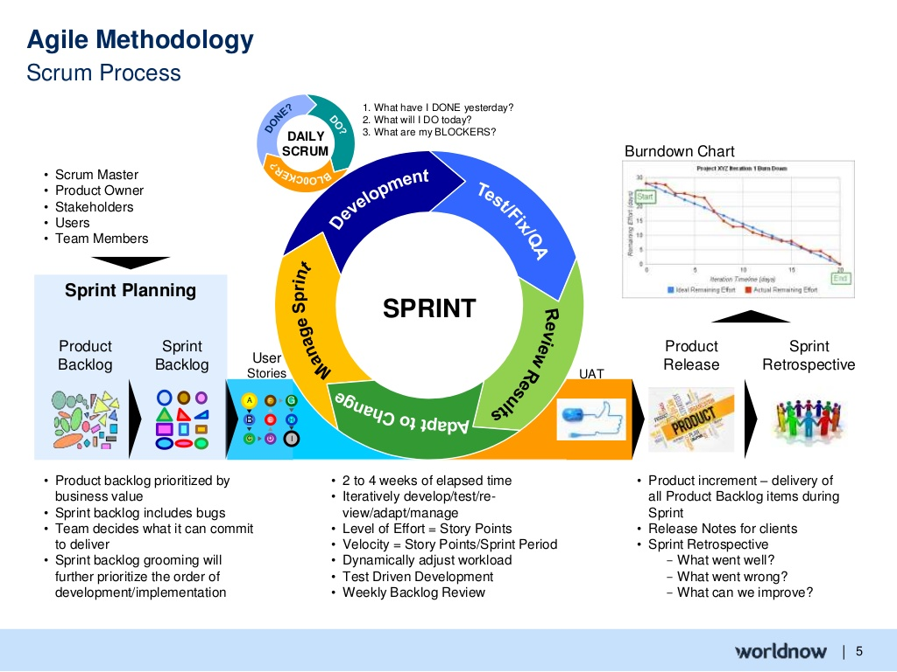

Agile có 4 tuyên ngôn chính, được mô tả trong Agile Manifesto (Tuyên ngôn Agile). Đây là cơ sở và nguyên tắc căn bản của Agile. Dưới đây là 4 tuyên ngôn của Agile:

1. "Individuals and interactions over processes and tools" (Cá nhân và tương tác hơn quy trình và công cụ): Tuyên ngôn này đặt sự tập trung vào sức mạnh của con người và sự tương tác giữa các thành viên trong một dự án phát triển. Agile coi trọng việc xây dựng một môi trường làm việc có sự tương tác tích cực, giao tiếp thông qua đối thoại trực tiếp và đặt sự lắng nghe và hiểu biết người khác lên hàng đầu.

2. "Working software over comprehensive documentation" (Phần mềm hoạt động hơn là tài liệu chi tiết): Agile ưu tiên việc tạo ra phần mềm hoạt động và mang giá trị thực cho khách hàng. Thay vì tập trung quá nhiều vào việc tạo ra tài liệu chi tiết và dày đặc, Agile khuyến khích việc tạo ra các phiên bản phần mềm hoạt động sớm, để kiểm tra, phản hồi và điều chỉnh nhanh chóng.

3. "Customer collaboration over contract negotiation" (Sự cộng tác với khách hàng hơn là đàm phán hợp đồng): Agile coi trọng sự tương tác và hợp tác tốt với khách hàng. Thay vì chỉ dựa vào việc đàm phán và đưa ra hợp đồng chi tiết trước khi bắt đầu dự án, Agile khuyến khích khách hàng và nhóm phát triển cùng làm việc, cùng đánh giá, và cùng điều chỉnh theo phản hồi liên tục từ khách hàng.

4. "Responding to change over following a plan" (Phản ứng và thích ứng với sự thay đổi hơn là tuân thủ một kế hoạch): Agile thừa nhận rằng sự thay đổi là tất yếu trong quá trình phát triển phần mềm. Thay vì tuân thủ một kế hoạch chi tiết và cố gắng duy trì nó bất kể sự thay đổi, Agile khuyến khích nhóm phát triển linh hoạt và sẵn sàng thích ứng với sự thay đổi. Việc phản ứng và điều chỉnh nhanh chóng là cách tốt nhất để đáp ứng nhu cầu khách hàng và tạo ra giá trị tối đa.

