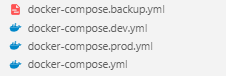

### Dockerfile basic

RECOMMEND: https://www.youtube.com/watch?v=9zUHg7xjIqQ

```shell
FROM node:16
WORKDIR /app
COPY package.json .
RUN npm install
COPY . ./
EXPOSE 3000
CMD [ "node", "index.js" ]
```

### Build image:
```shell
docker build -t node-app-image .
```

### Build container 
```shell
docker run -p 4000:3000 -d --name node-app node-app-image
```
-p: PORT, mapping cổng 4000 ở ngoài vào cổng 3000 trong container  
node-app: Name container    
node-app-image: Name image  
Trong câu lệnh này, -d là một tùy chọn (option) được sử dụng với lệnh docker run. Nó có nghĩa là "detach" (tách rời), có nghĩa là chạy container trong chế độ nền, không liên kết với terminal hiện tại của người dùng. Khi container được chạy với tùy chọn này, terminal sẽ không hiển thị logs và thông tin của container đang chạy, và người dùng có thể sử dụng terminal để thực hiện các công việc khác mà không bị gián đoạn bởi quá trình container đang chạy.

### Del all image and container

To delete all containers including its volumes use,
```shell
docker rm -vf $(docker ps -aq)
```

To delete all the images,
```shell
docker rmi -f $(docker images -aq)
```

### Docker inspect
```shell
docker inspect docker-node-app-1
```

### Mount forder của webapp vào container:
```shell
docker run -p 4000:3000 -v pathfolderonlocation:pathfolderoncontainer -d --name node-app node-app-image
```

v: volumn

### Access vào môi trường của docker
```shell
docker exec -it node-app bash
```

Show log
```log
docker logs node-app -f
```
-f: follow logs

Docker volumn anonymous
```shell
docker run -p 4000:3000 -v $(pwd):/app -v /app/node_modules -d --name node-app node-app-image
```
-v /app/node_modules: Hey đừng có động vào node_modules trong container

Docker volumn read only
```shell
docker run -p 4000:3000 -v $(pwd):/app:ro -v /app/node_modules -d --name node-app node-app-image
```
-v $(pwd):/app:ro: Container chỉ đọc không được thêm sửa xoá file
--env-file ./.env: .env file

### Docker volume
1. Docker volume  
Docker volume là một tính năng trong Docker cho phép lưu trữ dữ liệu ở ngoài container, giúp cho việc quản lý dữ liệu trở nên dễ dàng và có tính linh hoạt hơn.

Mục đích của việc sử dụng Docker volume là để lưu trữ dữ liệu của ứng dụng, như cơ sở dữ liệu, file log, hoặc bất kỳ tệp nào mà ứng dụng của bạn sử dụng. Nó giúp bạn giữ cho dữ liệu của bạn an toàn và tránh bị mất trong trường hợp container bị xóa hoặc cập nhật.

Các volume trong Docker được tạo ra bằng cách liên kết một thư mục trong container với một thư mục trên host. Khi container được tạo ra và chạy, dữ liệu trong volume sẽ được truy cập thông qua thư mục trên host.

Một cách dễ hiểu nhất để nói về Docker volume có thể là nó giống như một thùng chứa để lưu trữ các tài nguyên của container. Như vậy, các tài nguyên này sẽ không bị mất khi container bị xóa hoặc cập nhật, và có thể được chia sẻ và sử dụng bởi nhiều container khác nhau trên cùng một host.

2. Host  
Thư mục trên host (host directory) là thư mục trên hệ thống máy tính (physical machine) mà Docker đang chạy. Đây là thư mục mà bạn có thể truy cập bằng cách sử dụng các lệnh và các công cụ quản lý file của hệ điều hành, và nó được sử dụng để lưu trữ các file và dữ liệu được sử dụng bởi Docker container.

Khi bạn tạo ra một volume trong Docker, bạn sẽ liên kết một thư mục trong container với một thư mục trên host. Vì vậy, các dữ liệu được lưu trữ trong volume này sẽ được lưu trữ và quản lý trong thư mục trên host. Điều này cho phép bạn dễ dàng truy cập và quản lý dữ liệu của bạn bên ngoài container, và đảm bảo rằng dữ liệu của bạn sẽ không bị mất khi container bị xóa hoặc cập nhật.

### Docker compose
Docker Compose là một công cụ được sử dụng để quản lý và triển khai các ứng dụng được đóng gói trong các container Docker.

```yaml
version: '3'
services:
  node-app:
    build: .
    ports:
      - "3000:3000"
    volumes:
      - ./:/app
      - /app/node_modules
    environment:
      - PORT=3000
```

```shell
docker compose up -d
```
Lệnh này sẽ tạo và khởi chạy các container dựa trên cấu hình được định nghĩa trong file docker-compose.yml  
-d được sử dụng để chạy các container ở chế độ nền, tức là các container sẽ chạy ở background và không chiếm quá nhiều tài nguyên của hệ thống.

```shell
docker compose down -v
```
Lệnh này sẽ dừng và xóa các container và mạng mà được khởi chạy bởi Docker Compose.  
-v được sử dụng để xóa các volumes liên quan đến các container. Việc xóa volumes có thể giúp giải phóng tài nguyên đĩa cứng của máy tính.

### Docker compose multiple env:  

  

Dockerfile
```shell
FROM node:16
WORKDIR /app
COPY package.json .
ARG NODE_ENV
RUN if [ "$NODE_ENV" = "development"]; \
      then npm install; \
      else npm install --only=production; \
    fi
COPY . ./
ENV PORT 2000
EXPOSE $PORT
CMD [ "node", "index" ]
```

Base env:
```shell
version: '3'
services:
  node-app:
    build: .
    ports:
      - "3000:3000"
    environment:
      - PORT=3000
```

Dev env:
```shell
version: '3'
services:
  node-app:
    build:
      context: .
      args:
        NODE_ENV: development
    ports:
      - "3000:3000"
    volumes:
      - ./:/app
      - /app/node_modules
    environment:
      - NODE_ENV=development
    command: npm run dev
```

Run development env
```shell
docker compose -f docker-compose.yml -f docker-compose.dev.yml up -d
```

### Dockerignore   
Giống như .gitignore, nó không copy những folder hay file không cần thiết vào Virtual Machine, cụ thể là Docker Container

### Docker overlay (/var/lib/docker)

Docker Overlay là một driver lưu trữ (storage driver) được sử dụng trong Docker để quản lý các layer và lưu trữ các container và image. Nó là một phần của hệ thống quản lý lưu trữ Docker.

Khi bạn tạo một container hoặc image trong Docker, Overlay driver sẽ tạo ra các layer (lớp) riêng biệt để lưu trữ các thay đổi từng bước trong quá trình xây dựng container hoặc image đó. Mỗi layer đại diện cho một phần cụ thể của file hệ thống. Những layer này có thể chứa các file, thư mục, hoặc thay đổi được thực hiện trong quá trình thực thi container.

Overlay driver sử dụng kỹ thuật OverlayFS, một tính năng có sẵn trong hệ điều hành Linux kernel. OverlayFS cho phép nhiều lớp (layers) file hệ thống được gắn kết chồng lên nhau để tạo thành một file hệ thống duy nhất. Khi một tệp tin được truy cập, OverlayFS sẽ tìm kiếm lần lượt qua các lớp đến khi tìm thấy tệp tin cần thiết.

Các container và image trong Docker sẽ sử dụng các layer Overlay để lưu trữ các thay đổi và tạo ra một hệ thống file ảo. Các thay đổi trong container được ghi lại trong các layer riêng biệt, và chỉ các thay đổi mới nhất được hiển thị khi truy cập vào container đó. Điều này giúp giảm dung lượng lưu trữ và tăng tính hiệu quả trong việc tạo, chia sẻ, và quản lý các container và image.

Tổng quan, Overlay driver trong Docker là một cơ chế lưu trữ được sử dụng để quản lý các layer và lưu trữ các container và image. Nó sử dụng kỹ thuật OverlayFS để tạo ra các layer và gắn kết chồng lên nhau để tạo thành một hệ thống file ảo cho các container và image trong Docker.


Để xóa các layer cũ của Docker Overlay, bạn có thể sử dụng lệnh `docker system prune`. Lệnh này sẽ xóa các dữ liệu không sử dụng, bao gồm các image, container, volume và network không còn sử dụng.

Vui lòng lưu ý rằng việc xóa các layer cũ có thể ảnh hưởng đến các container và image đang sử dụng chúng. Hãy đảm bảo rằng bạn đã sao lưu các dữ liệu quan trọng trước khi thực hiện thao tác này.

Để xóa các layer cũ, hãy thực hiện các bước sau:

1. Mở terminal hoặc command prompt.
2. Chạy lệnh sau để xóa các layer cũ của Docker Overlay:

   ```shell
   docker system prune
   ```

3. Docker sẽ yêu cầu xác nhận việc xóa các dữ liệu không sử dụng. Nhấn `y` và nhấn Enter để tiếp tục.

Lệnh trên sẽ xóa các layer cũ của Docker Overlay, giải phóng không gian lưu trữ và loại bỏ các dữ liệu không còn sử dụng. Sau khi thực hiện xóa, bạn sẽ có được một hệ thống Docker sạch hơn và sử dụng không gian lưu trữ hiệu quả hơn.


