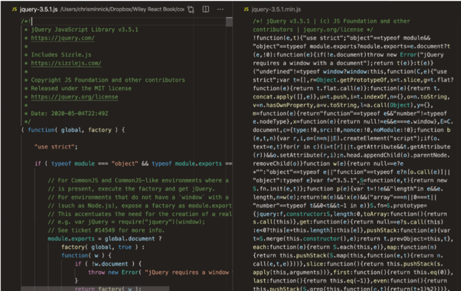
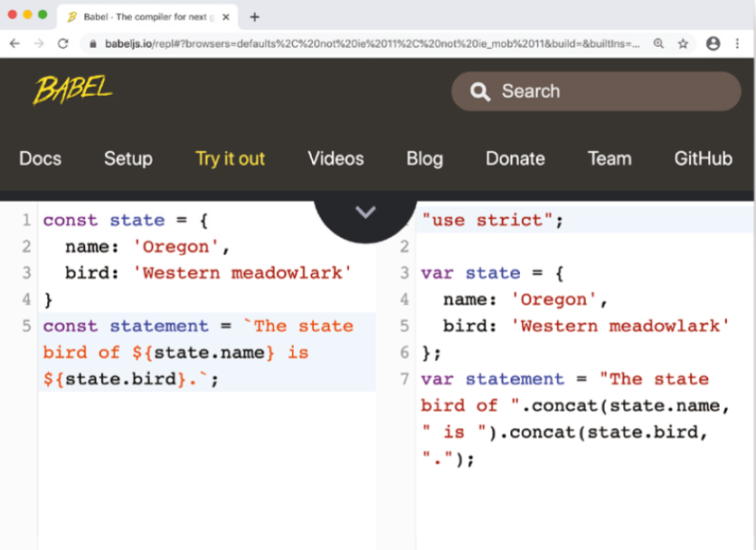
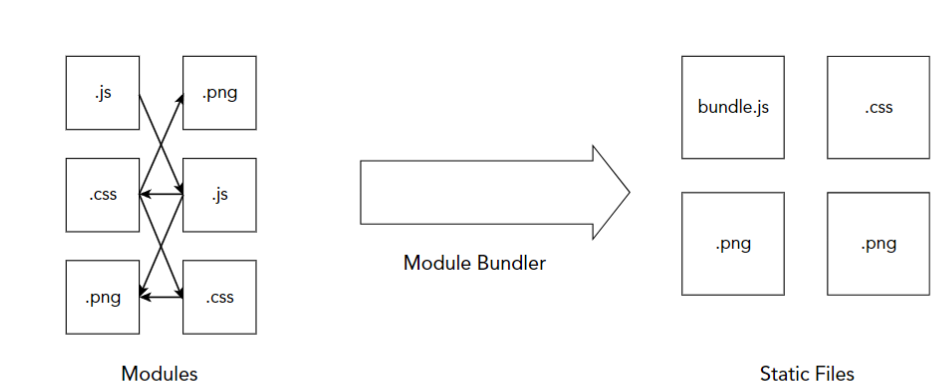
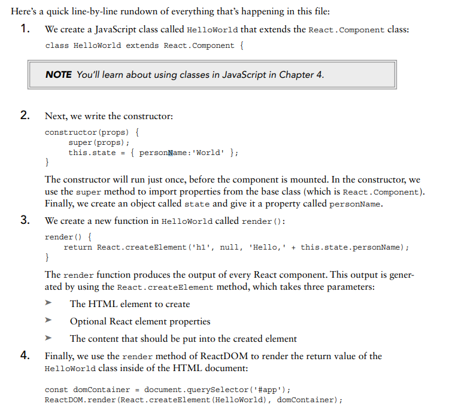
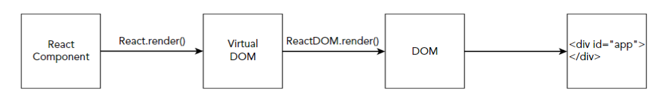
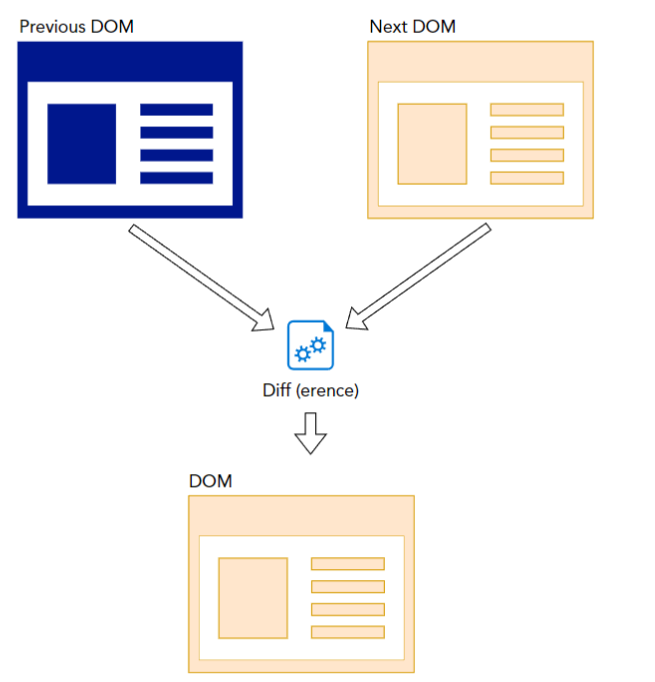
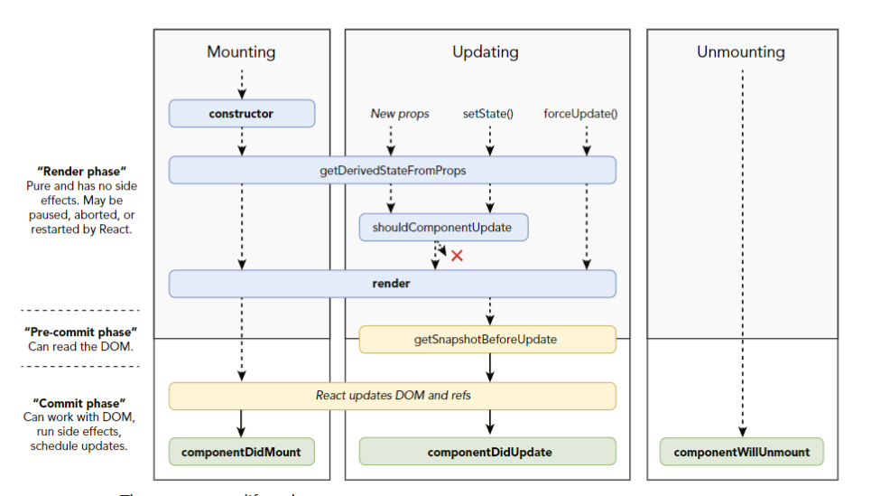
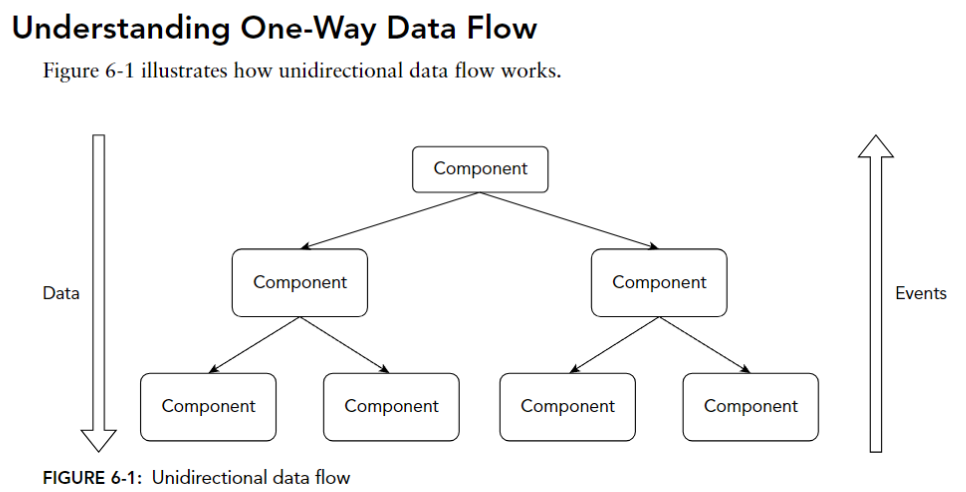
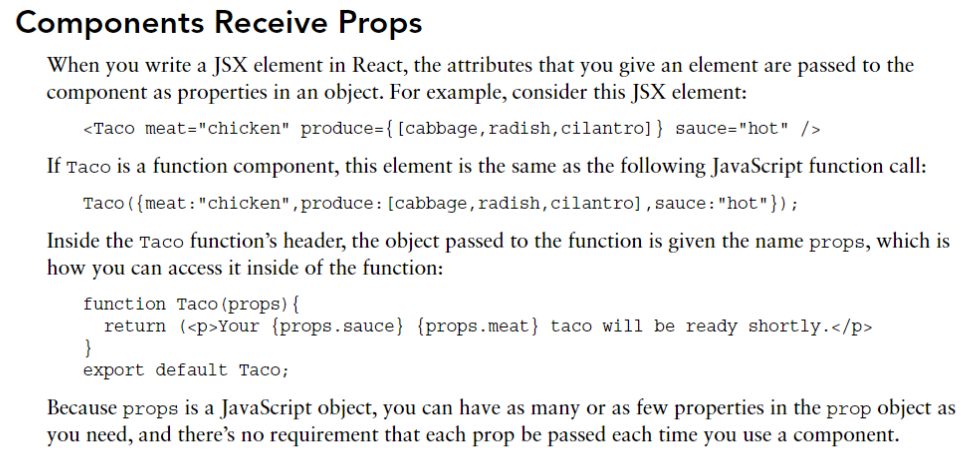

### History

React is a JavaScript library for creating interactive user interfaces using components. It was created by Facebook in 2011 for use on Facebook’s newsfeed and on Instagram. In 2013, the first version of React was released to the public as open source software. Today, it’s used by many of the largest websites and mobile apps, including Facebook, Instagram, Netflix, Reddit, Dropbox, Airbnb, and thousands of others

### Nodejs using

Common tasks that take place in development and that can be aided by Node.js include:

- Minification: The process of removing spaces, line breaks, comments, and other code that’s not required for the program to run, but that is helpful for people who work on the program. Minification makes scripts, web pages, and stylesheets more efficient and faster. Figure I-9 shows the difference between JavaScript code as it’s written by a programmer and min-ified code

 

- Transpiling: The process of converting programming code from one version of a program-ming language into another version. This is necessary in web development because not all web browsers support the same set of new JavaScript features, but they do all support some core subset of JavaScript features. By using a JavaScript transpiler, programmers can write code using the latest version of JavaScript and then the transpiled code can be run in any web browser. Figure I-10 shows an example use of JavaScript template strings, which were intro-duced in ES2015, along with their equivalent in an earlier version of JavaScrip

 

- Module bundling: A typical website can make use of hundreds of individual JavaScript  programs. If a web browser had to download each of these different programs individually, it would significantly slow down web pages due to the overhead involved with requesting files from web servers. The main job of a module bundler is to combine (or “bundle”) the  JavaScript and other code involved in a web application to make serving the application faster. Because a bundler has to do work to all of the files in a program, it also is a good central place for tasks like minification and transpiling to take place, through the use of plugins. Figure I-11 illustrates the process of module bundling

 

- Package management: With so many different programs involved in JavaScript development, just installing, upgrading, and keeping track of them can be quite complex. A package man-ager is a program that helps you with tasks related to the management of all these programs (which are also known as “packages” in Node.js lingo)

- A CSS preprocessor, such as SASS or LESS, allows you to write style sheets for your web application using a superset of CSS (such as SCSS) that supports the pro-grammatic features that CSS lacks— things like variables, mathematic operations, functions, scope, and nesting. A CSS preprocessor produces standard CSS from code written using an alternative syntax.

- Testing frameworks: Testing is an essential part of any web project. Properly written tests can tell you whether each piece of your application is working as it was designed. The process of writing logic to test whether your application works as it should is also a powerful tool for helping you to write better code

- Build automation: If you had to run each of the different tools involved in compiling a modern web app every time you wanted to test it out and deploy it to the web, you would have a very complex series of steps to follow and use to train anyone else who might work on the code. Build automation is the process of writing a program or script that runs all of the different tools for you in the right order to quickly and reliably optimize, compile, test, and deploy applications

The production version of React uses minified component names, and most of the debugging func-tionality is removed in order to increase performance and decrease the size of the download required for the browser to run React

### Naming Your react App

➤➤ It must be less than 214 characters long.

➤➤ The name can’t start with a dot or underscore.

➤➤ The name can’t have uppercase letters.

➤➤ It can’t contain any characters that aren’t allowed in URLs (such as ampersands and dollar signs) and that are “unsafe” in URLs (such as the percent symbol and spaces)

➤➤ Keep it simple and as short as possible.

➤➤ Use only lowercase letters.

➤➤ Use dashes in place of spaces.

➤➤ Don’t use the same name as a common Node.js package

```js
class HelloWorld extends React.Component {
  constructor(props) {
    super(props);
    this.state = { personName: 'Murray' };
  }
  render() {
    return React.createElement('h1', null, 'Hello, ' + this.state.personName);
  }
}
const domContainer = document.querySelector('#app');
ReactDOM.render(React.createElement(HelloWorld), domContainer);
```

 

### The Foundation of React

#### WHAT’S IN A NAME?

Let’s start with the name “React.” Facebook designed React in response to its need to be able to efficiently update websites in response to events. Events that can trigger updates in websites include user input, new data coming into the application from other websites and data sources, and data coming into the application from sensors (such as location data from GPS chips)

 Facebook wanted to create a way to more easily build applications that respond, or react to new data, rather than simply refreshing pages whether the underlying data has changed or not. You can think of the differ-ence in approaches as pull (which is the traditional way of updating websites) vs. push (which is the reactive way to build websites)

 This method of updating a user interface in response to data changes is calledreactive programming

#### Relationship between React, ReactDOM, and a web browser

 

ReactDOM is what makes it possible for user interfaces built in React to handle the quantity of screen changes required by modern web applications so efficiently. It does this through the use of a Virtual DOM

#### VIRTUAL DOM

The Document Object Model, or DOM, is a web browser’s internal representation of a web page. It converts HTML, styles, and content into nodes that can be operated on using JavaScrip

If you’ve ever used the getElementById function or set the innerHTML of an element, you’ve inter-acted with the DOM using JavaScript. Changes to the DOM cause changes to what you see in your web browser, and updates made in the web browser (such as when you enter data into a form) cause changes to the DOM.

Compared to other kinds of JavaScript code, DOM manipulation is slow and inefficient. This is because whenever the DOM changes, the browser has to check whether the change will require the page to be redrawn and then the redrawing has to happen

When the engineers at Facebook designed React, they decided to take the details of how and when the DOM is modified out of the hands of programmers. To do this, they created a layer between the code that the programmer writes and the DOM. They called this intermediary layer the Virtual DOM

Here’s how it works:
1. A programmer writes React code to render a user interface, which results in a single React element being returned.
1. ReactDOM’s render method creates a lightweight and simplified representation of the React element in memory (this is the Virtual DOM).
1. ReactDOM listens for events that require changes to the web page.
1. The ReactDOM.render method creates a new in- memory representation of the web page
5. The ReactDOM library compares the new Virtual DOM representation of the web page to the previous Virtual DOM representation and calculates the difference between the two. This process is called reconciliation.
1. ReactDOM applies just the minimal set of changes to the browser DOM in the most efficient way that it can and using the most efficient batching and timing of changes

 

#### Thinking in Components

React is a library for creating and putting together (or composing) components to build user interfaces. React components are independent pieces that can be reused and that can pass data to each other

> Single Responsibility means that a class [or what we call a “component” in React] should have only one reason to change

#### Composition vs. Inheritance

Using composition
```js
function Dialog(props) {
    return (
        <div className="dialogStyle">{props.message}</div>
    )
}

function WelcomeDialog(props) {
    return (
        <Dialog message="Welcome to our app!" />
    )
}
```

Asynchronous Module Definition (AMD)

Before you can run a React application that uses JSX and modules, it must first be compiled. During the compile (also known as “build”) process, all of the modules are joined together and the JSX code is converted into pure JavaScript

#### JSX Transform

One of the steps in the transpilation of React code is the JSX Transform. The JSX Transform is a process in which the transpiler takes JSX code (which isn’t natively understood by web browsers) and converts it into plain JavaScript (which is natively understood by web browsers)

The tool we use for transpilation in JavaScript is called Babel. Babel is integrated into Create React App and is an automatic part of compiling a React app built with Create React App

NOTE: Prior to version 17 of React, the JSX Transform converted JSX into React.createElement() statements. With React 17, the JSX Transform was rewritten so that it transforms JSX into browser-readable code without using React.createElement().

#### React.createClass was deprecated as of React 15.

#### What Are Function Components?
Function components are JavaScript functions that return React element

 
 
 