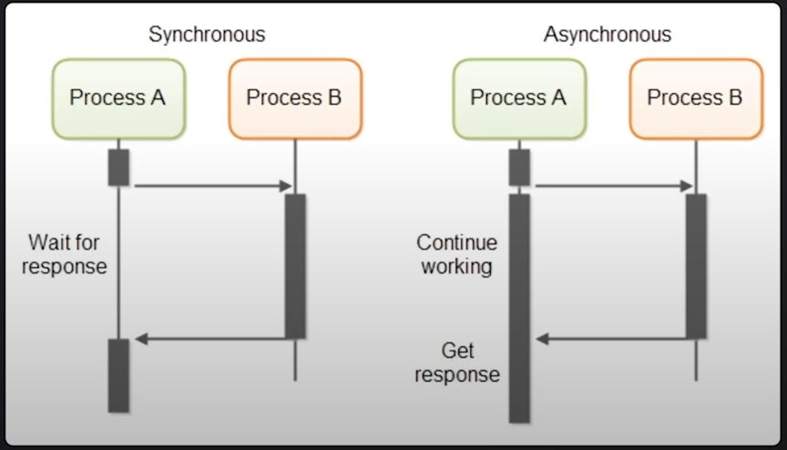
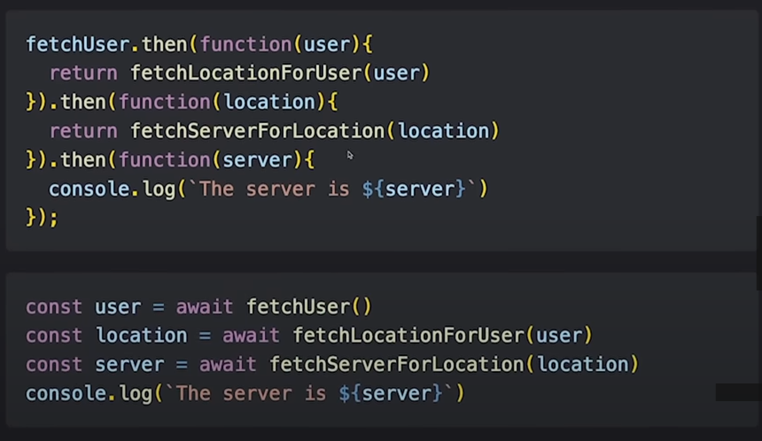

### Mở đầu bằng cái ảnh phát nhở
 
 

### I/O Timings
| Area  | Time | Description |
| ------------- | ------------- | ------------- |
| Ram | ns | Sync: Thường thì rất nhanh, như 1 cái chớp mắt, thường là khai báo biến, .. |
| Network | 100-2000ms | async: Có thể gọi api từ 1 nơi rất xa trên thế giới, dưới biển chả hạn, hay những toà nhà chọc trời ở dubai |
| Disk | 1ms | async/sync: Cũng nhanh nhưng 1 số task vụ cần nhiều thời gian, thường là tương tác file FS |
| Network | 100-2000ms | async: Có thể gọi api từ 1 nơi rất xa trên thế giới, dưới biển chả hạn, hay những toà nhà chọc trời ở dubai |
## Mindset 
### Bug and Error
