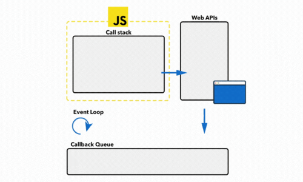

### Event loop JS

 

##### Bài toán

```js
console.log('Start');

setImmediate(() => {
  console.log('Immediate');
});

setTimeout(() => {
  console.log('Timeout');
}, 0);

console.log('End');
```

##### F12 chạy trên browser: 

```shell
Start
End
Immediate
Timeout
```

##### F12 chạy trên nodejs: 

```shell
Start
End
Timeout
Immediate
```

##### Giải thích:

Thứ tự thực thi giữa `setTimeout()` và `setImmediate()` có sự khác biệt giữa môi trường Node.js và trình duyệt. 

Trình duyệt tuân theo chuẩn của Web APIs, trong đó thực thi theo cơ chế mô phỏng đồng bộ hóa, và cung cấp một hàng đợi gọi là "microtask queue" để xử lý các tác vụ như `setImmediate()`. Khi bạn sử dụng `setImmediate()` trong trình duyệt, nó sẽ được đưa vào microtask queue và thực thi ngay sau khi main thread hoàn thành xử lý hiện tại. Vì vậy, trong ví dụ trên, `setImmediate()` được thực thi trước `setTimeout()`.

Tuy nhiên, Node.js không tuân theo cơ chế mô phỏng đồng bộ hóa và không có microtask queue. Thay vào đó, Node.js sử dụng cơ chế sự kiện (event-driven) và event loop để xử lý tác vụ bất đồng bộ. Khi bạn sử dụng `setImmediate()` trong Node.js, nó sẽ được đưa vào hàng đợi gọi là "immediate queue" và thực thi trong giai đoạn "check phase" của event loop. Trong ví dụ trên, `setTimeout()` với thời gian 0 milliseconds được đưa vào hàng đợi "timer queue" trong giai đoạn "timers phase". Do đó, trong Node.js, `setTimeout()` có thể được thực thi trước `setImmediate()`.

Vì cách mà event loop và các hàng đợi được sử dụng trong Node.js và trình duyệt khác nhau, nên kết quả của `setTimeout()` và `setImmediate()` có thể thay đổi tùy thuộc vào môi trường mà bạn chạy code.

Lưu ý rằng thứ tự chính xác cũng có thể bị ảnh hưởng bởi yếu tố khác như tải trọng hệ thống và thời gian xử lý của các tác vụ khác trong event loop.

### URL
```js
const urlObj = new URL("https://mansteven.vercel.app/#/?id=docsify")

logs:
{
  hash:"#/?id=docsify"
  host:"mansteven.vercel.app"
  hostname:"mansteven.vercel.app"
  href:"https://mansteven.vercel.app/#/?id=docsify"
  origin:"https://mansteven.vercel.app"
  password:""
  pathname:"/"
  port:""
  protocol:"https:"
  search:""
}
```

### `setTimeout()` và `clearTimeout()`:
   - `setTimeout()` is used to schedule the execution of a function or a code snippet after a specified delay.
   - `clearTimeout()` is used to cancel a scheduled timeout set by `setTimeout()`.

Example:
```javascript
// Using setTimeout() to schedule the execution of a function after 2 seconds
const timeoutId = setTimeout(() => {
  console.log('2 seconds have passed');
}, 2000);

// Clearing the scheduled timeout using clearTimeout() before it expires
clearTimeout(timeoutId);
```
### `setInterval()` and `clearInterval()`:
   - `setInterval()` is used to schedule the repeated execution of a function or a code snippet at a specified interval.
   - `clearInterval()` is used to cancel a scheduled interval set by `setInterval()`.

Example:
```javascript
// Using setInterval() to schedule the execution of a function every 1 second
const intervalId = setInterval(() => {
  console.log('Performing...');
}, 1000);

// Clearing the scheduled interval after 5 seconds using clearInterval()
setTimeout(() => {
  clearInterval(intervalId);
  console.log('Interval has been cleared');
}, 5000);
```

### `setImmediate()` and `clearImmediate()`:
   - `setImmediate()` is used to schedule the execution of a function or a code snippet in the event loop immediately after the main thread completes.
   - `clearImmediate()` is used to cancel a scheduled immediate set by `setImmediate()`.

Example:
```javascript
// Using setImmediate() to schedule the execution of a function in the event loop
const immediateId = setImmediate(() => {
  console.log('setImmediate() has been executed');
});

// Clearing the scheduled immediate using clearImmediate()
clearImmediate(immediateId);
```