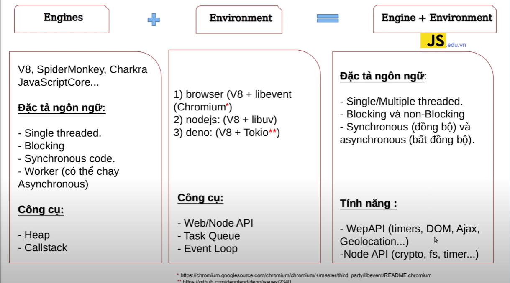
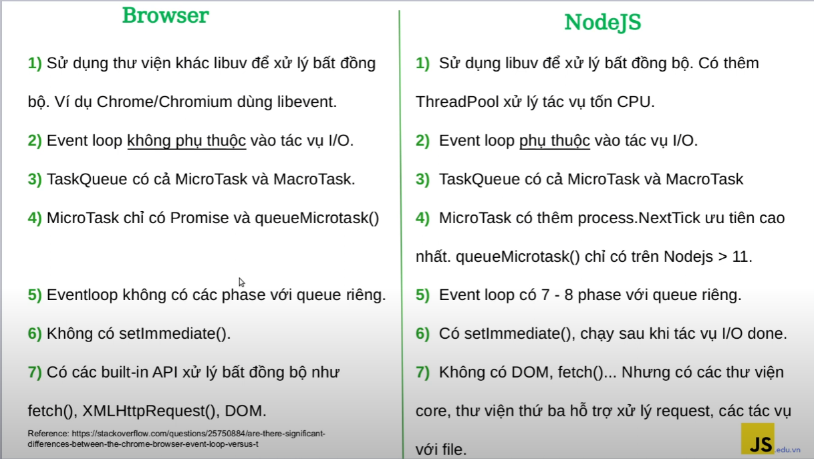
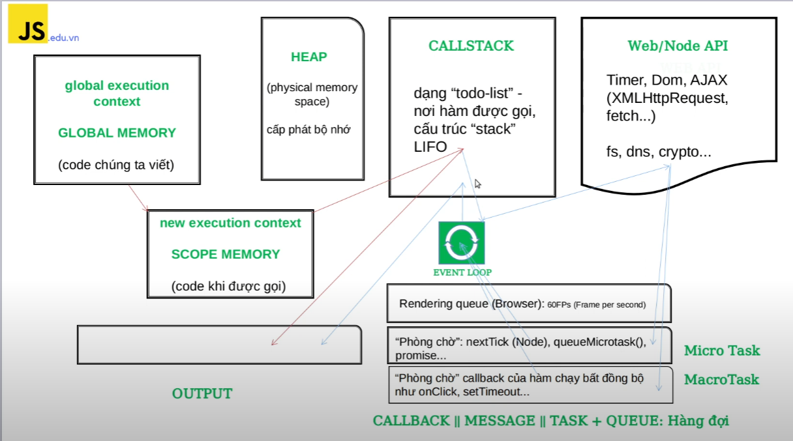
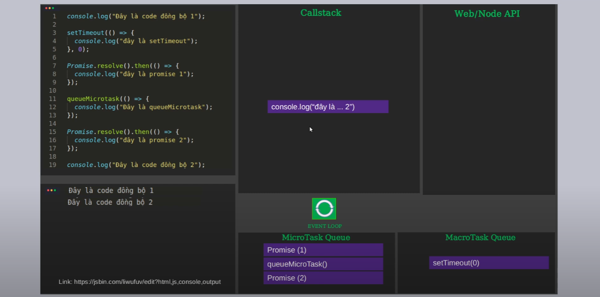
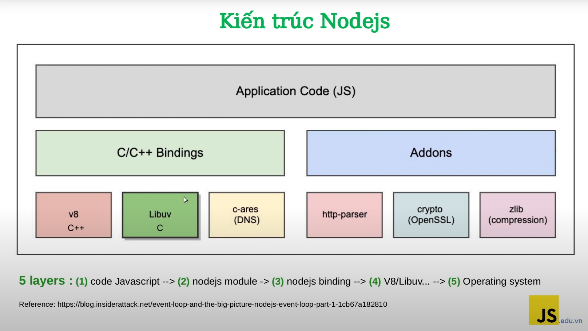
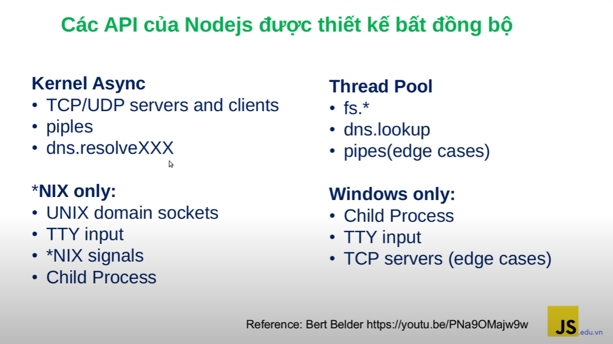
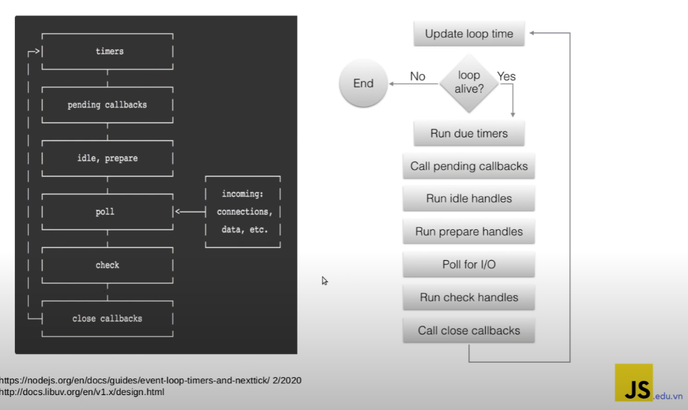
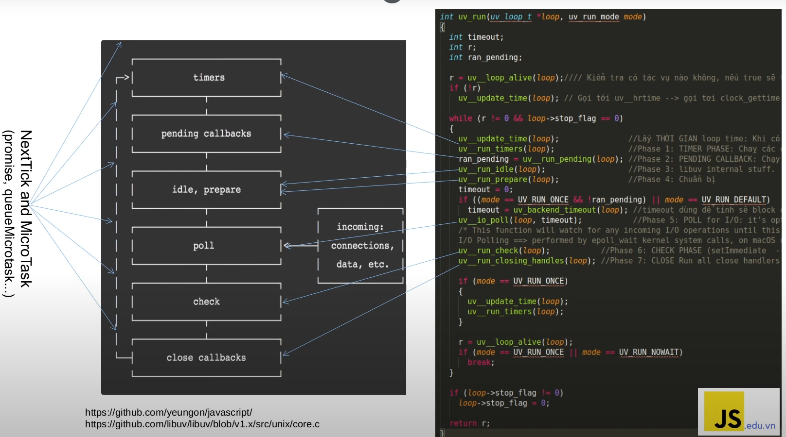
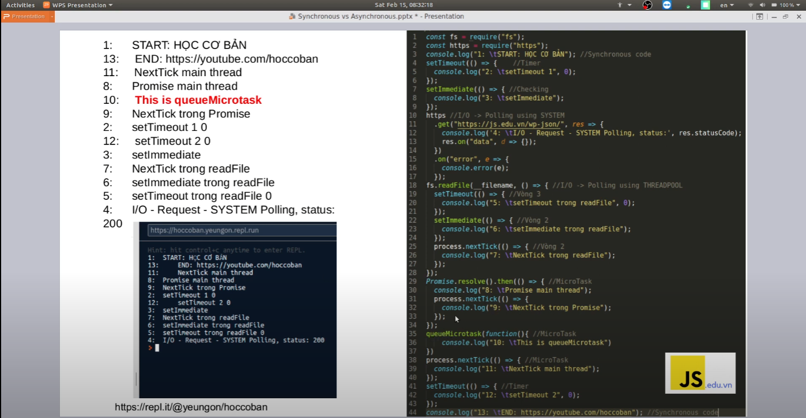
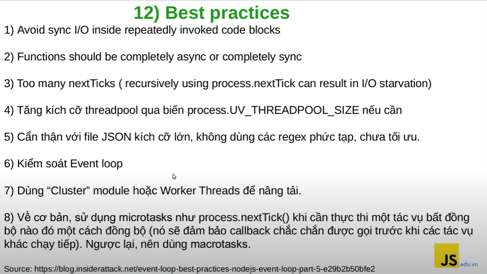

### Event Loop JS

#### Micro Tasks:

- Promise callbacks: Khi một Promise được giải quyết hoặc bị từ chối, các hàm được đăng ký thông qua .then(), .catch(), hoặc .finally() được xem như là các micro tasks.
- MutationObserver: Được sử dụng để theo dõi sự thay đổi trong DOM. Các callback của MutationObserver được xem như là các micro tasks.
- process.nextTick: Đối với môi trường Node.js, process.nextTick được sử dụng để lên lịch các hàm để chạy sau khi hoàn thành hiện tại của event loop.

#### Macro Tasks:

- setTimeout và setInterval: Được sử dụng để lên lịch thực thi một hàm sau một khoảng thời gian nhất định hoặc định kỳ.
- I/O operations: Ví dụ như đọc và ghi tệp tin, gửi và nhận dữ liệu qua mạng.
- XMLHttpRequest và fetch: Sử dụng để tạo các yêu cầu HTTP và xử lý các phản hồi.

### Event Loop Nodejs

Nodejs Architecture 

 
 
 

