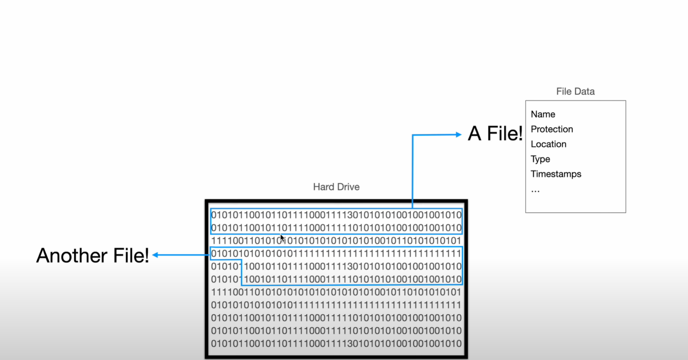

```js
const fs = require("fs/promises");

// open
// read or write

(async () => {
    const createFile = async (path) => {
        let existingFileHandle;
        try {
            // we want to check whether or not we already have that file
            existingFileHandle = await fs.open(path, "r");
            // we a;ready have that file ...
            existingFileHandle.close()
            return console.log(`The file ${path} already exists.`)     
        } catch (error) {
            const newFileHandle = await fs.open(path, "w");
            console.log("a new file was successfully created.");
            newFileHandle.close();
        }

    }

    const deleteFile = async (path) => {
        console.log(`Deleting ${path}...`);
        try {
            await fs.unlink(path);
        } catch (error) {
            if (error.code === 'ENOENT') {
                console.log("No file at this path to remove")
            } else {
                console.log("An error occurred while removing the file: ")
                console.log(e)
            }
        }
    }

    const renameFIle = async (oldPath, newPath) => {
        try {
            console.log(`Rename ${oldPath} to ${newPath}`);
            await fs.rename(oldPath, newPath)
        } catch (error) {
            if (error.code === 'ENOENT') {
                console.log("No file at this path to rename")
            } else {
                console.log("An error occurred while rename the file: ")
                console.log(error)
            }
        }
    }

    const addToFile = async (path, content) => {
        console.log(`Adding to ${path}`)
        console.log(`Content: ${path}`)
        try {
            const fileHandle = await fs.open(path, "a");
            fileHandle.write(content);

        } catch (error) {
            console.log("An error occurred while rename the file: ")
            console.log(error)
        }
    }
    // commands
    const CREATE_FILE = "create a file"
    const DELETE_FILE = "delete the file"
    const RENAME_FILE = "rename the file"
    const ADD_TO_FILE = "add to the file"
    const commandFileHandler = await fs.open("./command.txt", "r");

    commandFileHandler.on("change", async () => {
        // get the size of our file
        const size = (await commandFileHandler.stat()).size;
        // allocate our buffer with the size of the file
        const buff = Buffer.alloc(size);
        // the location at which we want to start filling our buffer
        const offset = 0;
        // how many bytes we want to read
        const length = buff.byteLength;
        // the posittion that we want to start reading  the file from
        const position = 0; // doc tu vi tri dau tien
        await commandFileHandler.read(buff, offset, length, position);
        
        const command = buff.toString("utf-8");
        // create a file;
        // create a file <path>
        if (command.includes(CREATE_FILE)) {
            const filePath = command.substring(CREATE_FILE.length + 1);

            createFile(filePath)
        }

        // delete a file
        // delete the file <path>
        if (command.includes(DELETE_FILE)) {
            const filePath = command.substring(DELETE_FILE.length + 1)
            deleteFile(filePath)
        }

        // rename file:
        // rename the file <path> to <new_path>
        if (command.includes(RENAME_FILE)) {
            const _idx = command.indexOf(' to ');
            const oldFilePath = command.substring(RENAME_FILE.length + 1, _idx);
            const newFilePath = command.substring(_idx + 4);

            await renameFIle(oldFilePath, newFilePath)
        }

        // add to file:
        // add to the file <path> this content: <content>
        if (command.includes(ADD_TO_FILE)) {
            const _idx = command.indexOf(' this content: ');
            const filePath = command.substring(ADD_TO_FILE.length, _idx);
            const content = command.substring(_idx + 15);

            addToFile(filePath, content)
        }
    })
    const watcher = fs.watch("./command.txt");

    for await (const event of watcher) {
        if (event.eventType === "change") {
            commandFileHandler.emit("change");
        }
    }
})();


```