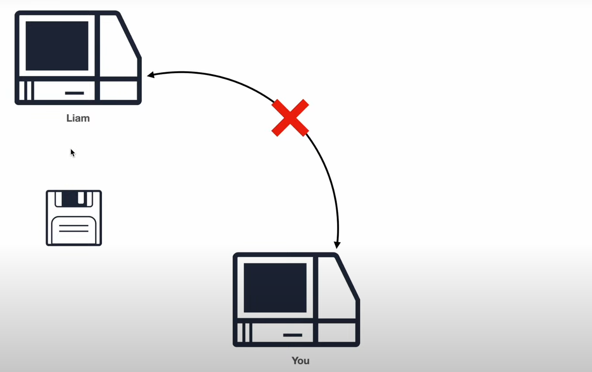
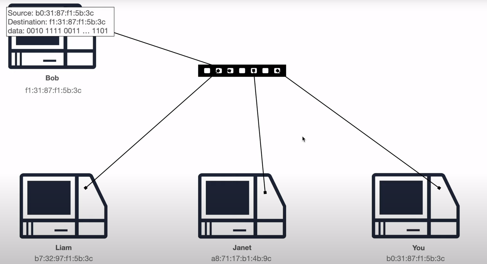
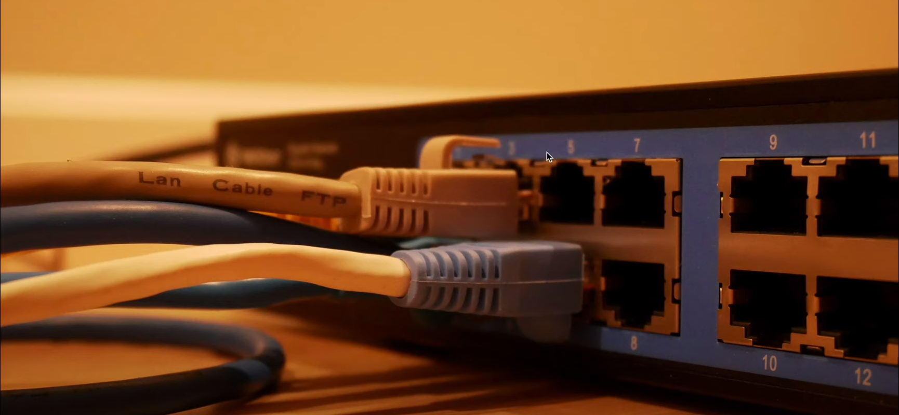
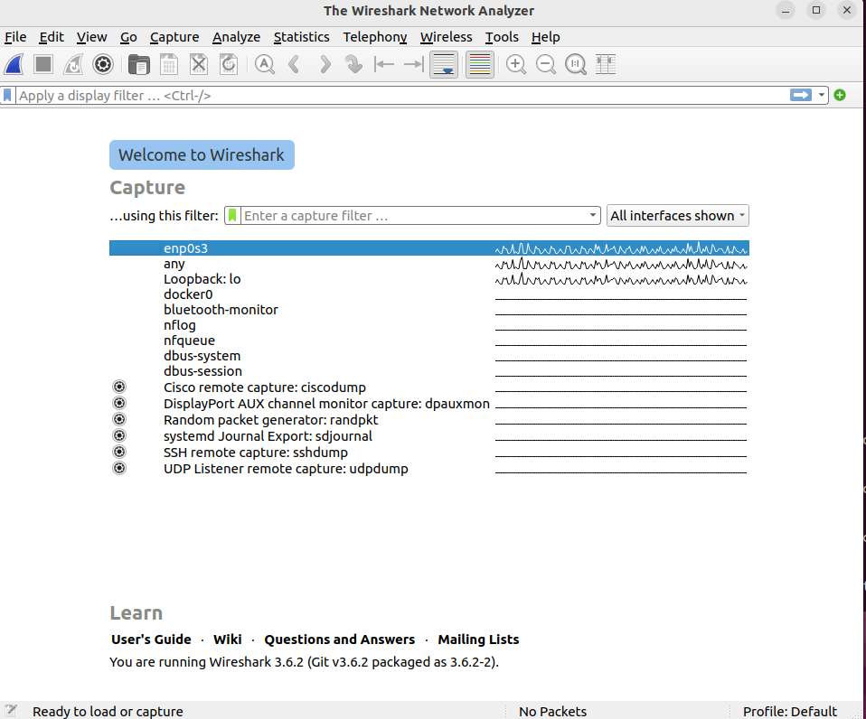
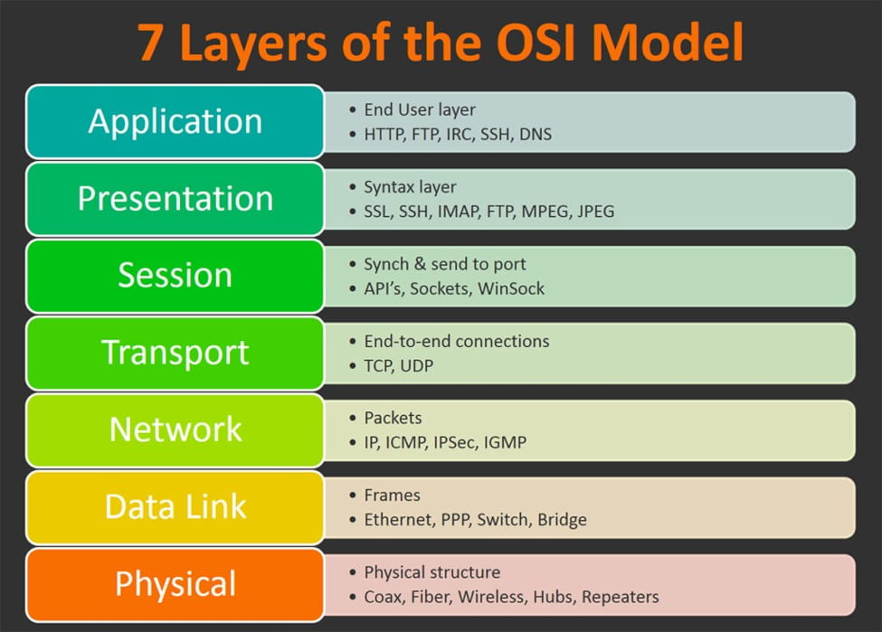

Cũ phải dùng đĩa CD để copy

Sử dụng switch card mạng

Mỗi 1 chỗ cắm tương ứng với 1 địa chỉ network của 1 máy

### Wireshark
Wireshark là một công cụ phân tích mạng và ghi lại lưu lượng giao thông (traffic) trong mạng. Nó là một phần mềm mã nguồn mở và được sử dụng phổ biến trong lĩnh vực mạng máy tính.

Wireshark cho phép người dùng xem và phân tích các gói tin (packets) đi qua mạng, giúp hiểu rõ về hoạt động và vấn đề mạng. Với khả năng theo dõi và ghi lại lưu lượng mạng, Wireshark cung cấp cho người dùng khả năng kiểm tra và phân tích các giao thức mạng như TCP/IP, UDP, DNS, HTTP, và nhiều giao thức khác.

Wireshark cung cấp giao diện đồ họa cho phép người dùng dễ dàng xem các gói tin mạng theo thời gian thực hoặc từ các tệp tin đã được ghi lại trước đó. Nó cho phép người dùng lọc và tìm kiếm các gói tin theo nhiều tiêu chí như địa chỉ IP, cổng, giao thức, từ khóa và các thông tin khác.

Wireshark không chỉ là công cụ hữu ích trong việc gỡ lỗi và khắc phục sự cố mạng, mà còn được sử dụng để kiểm tra hiệu suất mạng, phân tích bảo mật, và nghiên cứu về giao thức mạng.

### TCP & UDP & Port Number

#### TCP

TCP là một giao thức truyền tải dựa trên kết nối trong mạng máy tính. Nó cung cấp một kênh truyền tin cậy, đảm bảo dữ liệu được chuyển giao một cách chính xác và đúng thứ tự từ nguồn đến đích.

TCP sử dụng các khung (segments) để chia dữ liệu thành các đơn vị nhỏ hơn, gửi chúng qua mạng và xác nhận việc nhận dữ liệu. Nó hỗ trợ kiểm soát lỗi, điều chỉnh luồng dữ liệu và tái thiết lập kết nối trong trường hợp mất mát dữ liệu.

TCP đảm bảo tính toàn vẹn và độ tin cậy của dữ liệu, thích hợp cho các ứng dụng yêu cầu truyền tải dữ liệu chính xác như trình duyệt web, gửi email, tải tập tin, và các ứng dụng cần đồng bộ hóa dữ liệu.

#### UDP

UDP là một giao thức truyền tải dữ liệu không đáng tin cậy trong mạng máy tính. Nó cung cấp một phương thức truyền gói tin nhanh và đơn giản mà không đảm bảo tính toàn vẹn và đúng thứ tự của dữ liệu.

UDP không thực hiện kiểm soát lỗi, điều chỉnh luồng dữ liệu hoặc tái thiết lập kết nối. Gói tin được gửi đi mà không có quá trình xác nhận hoặc kiểm tra lỗi.

UDP thích hợp cho các ứng dụng yêu cầu truyền tải nhanh chóng như streaming media, video chat, game trực tuyến, nơi mất mát dữ liệu có thể được chấp nhận để đạt được tốc độ cao và phản hồi thời gian thực.

#### Port Number
Port numbers are assigned in various ways, based on three ranges: System
Ports (0-1023), User Ports (1024-49151), and the Dynamic and/or Private
Ports (49152-65535)

Ở 1 số hệ thống k thể chạy các port từ 0-1023, nếu bắt buộc phải chạy ứng dụng trên cấc PORT này thì cần chạy với sudo

### Network layer

Mô hình OSI (Open Systems Interconnection) gồm 7 lớp, mỗi lớp đóng vai trò cụ thể trong việc truyền tải dữ liệu qua mạng. Dưới đây là mô tả chi tiết từng lớp trong mô hình OSI:

Physical Layer (Lớp Vật lý):

- Lớp Physical Layer là lớp thấp nhất trong mô hình OSI.
- Nhiệm vụ của lớp này là xác định các giao diện vật lý và phương tiện truyền dẫn để truyền tải dữ liệu, bao gồm cáp mạng, đồng trục, quang học và sóng radio.
- Lớp Physical Layer xác định các thông số vật lý như điện áp, tần số, độ dài sóng và định dạng tín hiệu.

Data Link Layer (Lớp Liên kết dữ liệu):

- Lớp Data Link Layer xử lý việc truyền dữ liệu giữa hai nút mạng trực tiếp kề nhau trong mạng.
- Lớp này chịu trách nhiệm đóng gói dữ liệu thành các khung (frames), thực hiện kiểm soát luồng dữ liệu, kiểm tra lỗi và đảm bảo tính toàn vẹn của dữ liệu.
- Các giao thức phổ biến trong lớp Data Link Layer bao gồm Ethernet, Wi-Fi, và các giao thức HDLC và PPP.

Network Layer (Lớp Mạng):

- Lớp Network Layer quản lý việc định tuyến và điều khiển lưu lượng gói tin qua mạng.
- Lớp này sử dụng địa chỉ IP để xác định nguồn và đích, thực hiện việc chuyển tiếp dữ liệu giữa các mạng con và quản lý định tuyến.
- Giao thức phổ biến trong lớp Network Layer là Internet Protocol (IP).

Transport Layer (Lớp Vận chuyển):

- Lớp Transport Layer cung cấp các dịch vụ vận chuyển dữ liệu tin cậy giữa các quá trình (process) trên các thiết bị đầu cuối.
- Nhiệm vụ chính của lớp này là đóng gói dữ liệu thành các đoạn (segments) và xác định các kênh truyền tin cậy giữa các thiết bị.
- Giao thức phổ biến trong lớp Transport Layer bao gồm Transmission Control Protocol (TCP) và User Datagram Protocol (UDP).

Session Layer (Lớp Phiên):

Lớp Session Layer cung cấp một môi trường đáng tin cậy và an toàn cho các ứng dụng giao tiếp trên các hệ thống khác nhau. Nó đảm bảo rằng việc truyền tải dữ liệu giữa các ứng dụng diễn ra một cách hiệu quả và đồng bộ.

Presentation Layer (Lớp Trình bày):

- Lớp Presentation Layer xử lý việc biểu diễn và định dạng dữ liệu để đảm bảo khả năng tương thích giữa các hệ thống khác nhau.
- Lớp này mã hóa, nén, mã hóa và giải mã dữ liệu để đảm bảo tính toàn vẹn và bảo mật của thông tin trước khi chuyển đến lớp Application Layer.
- Nó cũng đảm nhận vai trò định dạng dữ liệu để ứng dụng có thể hiểu được và tương tác với nó.

Application Layer (Lớp Ứng dụng):

- Lớp Application Layer là lớp cao nhất trong mô hình OSI và cung cấp các dịch vụ trực tiếp cho người dùng cuối.
- Lớp này cho phép các ứng dụng truy cập vào mạng và sử dụng các dịch vụ mạng như truyền tập tập tin (File Transfer Protocol - FTP), truyền tải thư điện tử (Simple Mail Transfer Protocol - SMTP), duyệt web (Hypertext Transfer Protocol - HTTP), và nhiều dịch vụ khác.
- Lớp Application Layer tương tác trực tiếp với người dùng cuối và cung cấp giao diện để tương tác với các ứng dụng và dịch vụ mạng.
