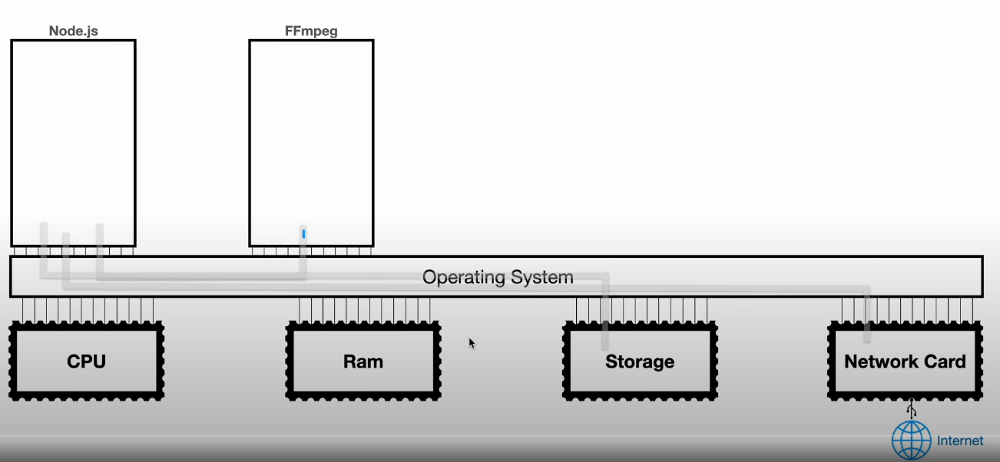
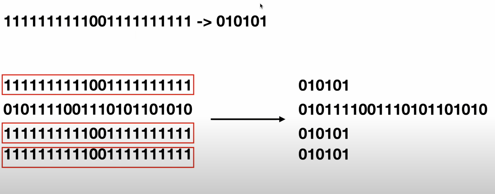
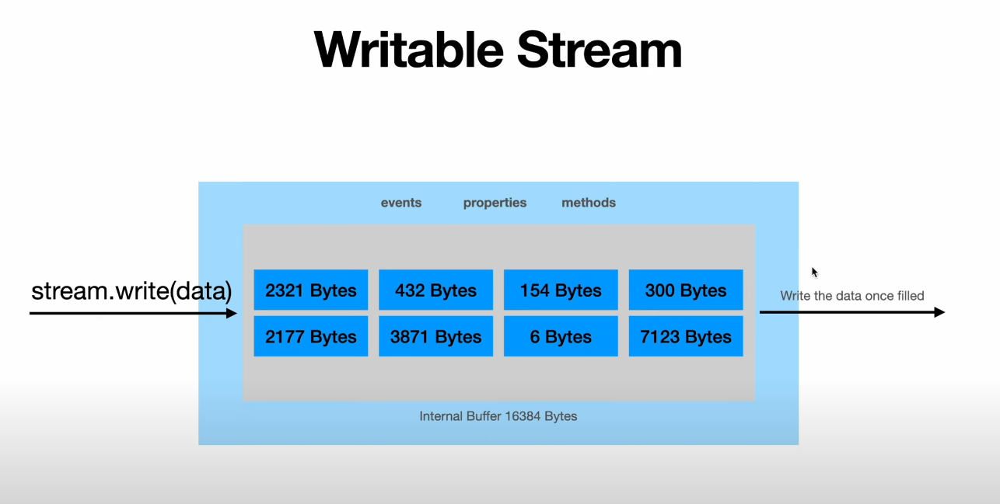
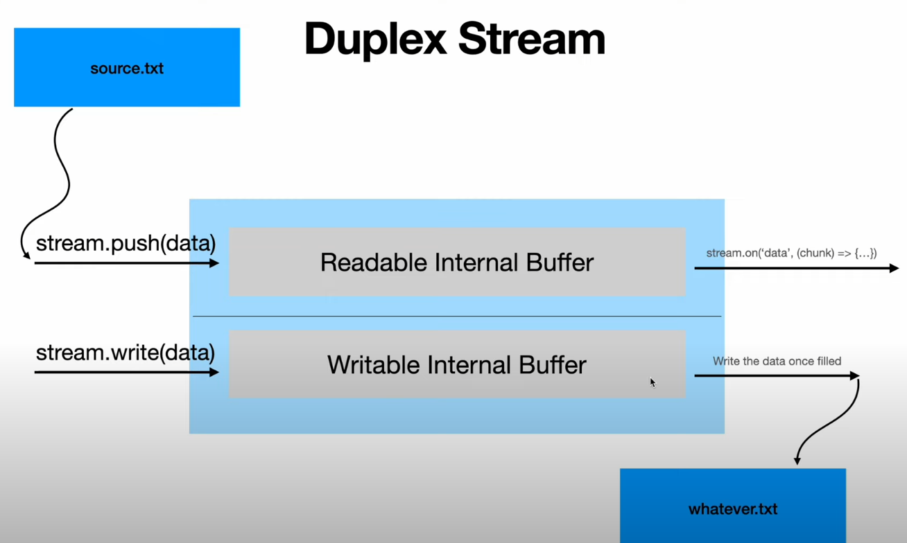
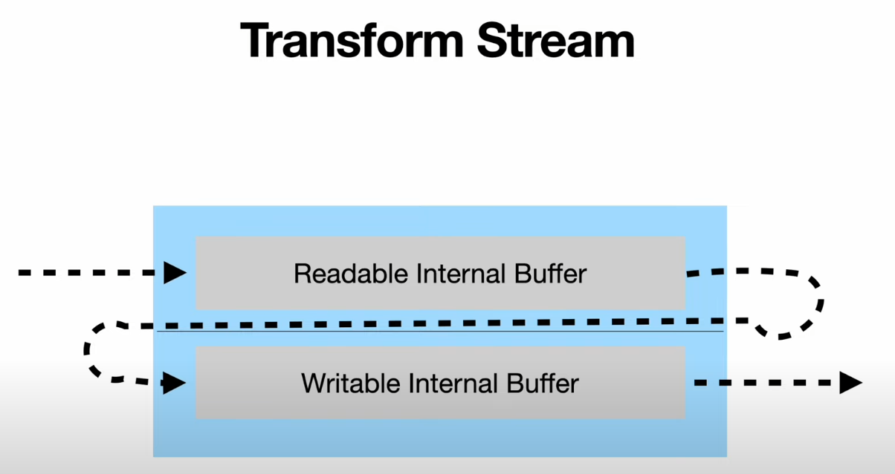

### Stream

Stream: An abstract interface for working with streaming data in Node.js

### Write many data into file





Normal write file
```js
const fs = require('node:fs/promises');

(async () => {
    console.time("writeMany");

    const fileHandle = await fs.open("text.txt", "w") 
    
    for (let i = 0; i< 1000000; i++){
        fileHandle.write(` ${i} `)
    }

    console.timeEnd("writeMany")
})()
```

```js
const fs = require('node:fs');

(() => {
    console.time("writeMany");

    fs.open("text.txt", "w", (err, fd) => {
        
        for (let i = 0; i< 1000000; i++){
            const buff = Buffer.from(` ${i} `, 'utf-8')
            fs.writeSync(fd, buff)
        }
    
        console.timeEnd("writeMany")
    }) 
    
})()
```

Using stream 
```js
// Gấp 15 lần 2 cách ghi fs.write 815.816ms
// const fs = require('node:fs/promises');

// (async () => {
//     console.time("writeMany");

//     const fileHandle = await fs.open("text.txt", "w") 

//     const stream = fileHandle.createWriteStream();
    
//     for (let i = 0; i< 1000000; i++){
//         const buff = Buffer.from(` ${i} `, 'utf-8')
//         stream.write(buff);
//     }

//     console.timeEnd("writeMany")
// })()

// Gấp 10000 lần 2 cách ghi fs.write 13.873ms
const fs = require('node:fs/promises');

(async () => {
    console.time("writeMany");

    const fileHandle = await fs.open("text.txt", "w") 

    const stream = fileHandle.createWriteStream();

    console.log(stream.writableHighWaterMark)
    
    let i = 0;

    const writeMany = () => {
        while (i < 1000000) {
            const buff = Buffer.from(` ${i} `, 'utf-8');

            // this is our last write
            if (i === 999999) {
                return stream.end(buff)
            }

            // this is our last
            if (!stream.write(buff)) break;

            i++;
        }
    }

    writeMany();

    // resume our loop once our stream's interna, buffer is emptied
    stream.on("drain", () => {
        console.log("manh")
        writeMany();
    })

    stream.on("finish", () => {
        console.timeEnd("writeMany");
        fileHandle.close();
    })

    console.timeEnd("writeMany")
    // fileHandle.close()
})()
```

### Read big file
```js
const fs = require("node:fs/promises");

(async () => {
  console.time("readBig");
  const fileHandleRead = await fs.open("text-small.txt", "r");
  const fileHandleWrite = await fs.open("dest.txt", "w");

  const streamRead = fileHandleRead.createReadStream({
    highWaterMark: 64 * 1024,
  });
  const streamWrite = fileHandleWrite.createWriteStream();

  let split = "";

  streamRead.on("data", (chunk) => {
    const numbers = chunk.toString("utf-8").split("  ");

    if (Number(numbers[0]) !== Number(numbers[1]) - 1) {
      if (split) {
        numbers[0] = split.trim() + numbers[0].trim();
      }
    }

    if (
      Number(numbers[numbers.length - 2]) + 1 !==
      Number(numbers[numbers.length - 1])
    ) {
      split = numbers.pop();
    }

    numbers.forEach((number) => {
      let n = Number(number);

      if (n % 10 === 0) {
        if (!streamWrite.write(" " + n + " ")) {
          streamRead.pause();
        }
      }
    });
  });

  streamWrite.on("drain", () => {
    streamRead.resume();
  });

  streamRead.on("end", () => {
    console.log("Done reading.");
    console.timeEnd("readBig");
  });
})();

```
### COpy file
```js
const { pipeline } = require("node:stream");
const fs = require("node:fs/promises");

// File Size Copied: 1 GB
// Memory Usage: 1 GB
// Execution Time: 900 ms
// Maximum File Size Able to Copy: 2 GB
// (async () => {
//   console.time("copy");
//   const destFile = await fs.open("text-copy.txt", "w");
//   const result = await fs.readFile("text-big.txt");

//   await destFile.write(result);

//   console.timeEnd("copy");
// })();

// File Size Copied: 1 GB
// Memory Usage: 30 MB
// Execution Time: 2 s
// Maximum File Size Able to Copy: No Limit
// (async () => {
//   console.time("copy");

//   const srcFile = await fs.open("text-gigantic.txt", "r");
//   const destFile = await fs.open("text-copy.txt", "w");

//   let bytesRead = -1;

//   while (bytesRead !== 0) {
//     const readResult = await srcFile.read();
//     bytesRead = readResult.bytesRead;

//     if (bytesRead !== readResult.buffer.length) {
//       // we have some null bytes, remove them at the end of the returned buffer
//       // and then write to our file
//       const indexOfNotFilled = readResult.buffer.indexOf(0);
//       const newBuffer = Buffer.alloc(indexOfNotFilled);
//       readResult.buffer.copy(newBuffer, 0, 0, indexOfNotFilled);
//       destFile.write(newBuffer);
//     } else {
//       destFile.write(readResult.buffer);
//     }
//   }

//   console.timeEnd("copy");
// })();

// File Size Copied: 1 GB
// Memory Usage: 30 MB
// Execution Time: 1 s
// Maximum File Size Able to Copy: No Limit
(async () => {
  console.time("copy");

  const srcFile = await fs.open("text-big.txt", "r");
  const destFile = await fs.open("text-copy.txt", "w");

  const readStream = srcFile.createReadStream();
  const writeStream = destFile.createWriteStream();

  // console.log(readStream.readableFlowing);

  // readStream.pipe(writeStream);

  // console.log(readStream.readableFlowing);

  // readStream.unpipe(writeStream);

  // console.log(readStream.readableFlowing);

  // readStream.pipe(writeStream);

  // console.log(readStream.readableFlowing);

  // readStream.on("end", () => {
  //   console.timeEnd("copy");
  // });

  // Don't use pipe in production, use pipeline instead! It will automatically
  // handle the cleanings for you and give you an easy way for error handling
  pipeline(readStream, writeStream, (err) => {
    console.log(err);
    console.timeEnd("copy");
  });
})();

```
### Duplex stream


### encryption
// busboy
encryption/decryption => crypto
compression => zlib
hashing/salting => crypto
decoding/encoding => buffer text-encoding/decoding

Encryption/Decryption: Mã hóa/ Giải mã là quá trình chuyển đổi dữ liệu văn bản (plaintext) thành dữ liệu không đọc được (ciphertext) bằng cách sử dụng thuật toán mã hóa và một khóa. Mã hóa đảm bảo chỉ có người được ủy quyền mới có thể truy cập vào dữ liệu gốc mà không cần khóa. Quá trình giải mã là quá trình đảo ngược.

Nén: Nén là quá trình giảm kích thước của dữ liệu để tiết kiệm không gian lưu trữ hoặc băng thông khi truyền dữ liệu. Các thuật toán nén sẽ loại bỏ dữ liệu trùng lặp, không cần thiết hoặc sử dụng các phương pháp khác để biểu diễn dữ liệu một cách hiệu quả hơn. Quá trình nén có thể được thực hiện theo hai phương pháp: nén không mất mát và nén mất mát.

Băm/Salting: Băm là quá trình chuyển đổi dữ liệu bất kỳ thành một chuỗi băm duy nhất, được gọi là giá trị băm. Thuật toán băm đưa ra kết quả băm duy nhất cho mỗi đầu vào, và thường không thể phục hồi dữ liệu gốc từ kết quả băm. Để tăng cường an ninh, một phương pháp gọi là salting (gắn muối) cũng được sử dụng. Salting là việc thêm một chuỗi ngẫu nhiên vào dữ liệu trước khi tiến hành quá trình băm, làm tăng độ khó cho các cuộc tấn công bằng cách tìm kiếm các giá trị băm thông qua việc thử nhiều giá trị khác nhau.

Giải mã/Mã hóa: Giải mã và mã hóa là các quá trình chuyển đổi giữa các hình thức biểu diễn dữ liệu. Mã hóa là quá trình chuyển đổi dữ liệu từ một định dạng sang một định dạng khác để bảo vệ dữ liệu hoặc cung cấp khả năng truyền tải dữ liệu. Giải mã là quá trình chuyển đổi dữ liệu từ định dạng đã được mã hóa trở lại định dạng ban đầu.

# Streams API (WEBUI)


