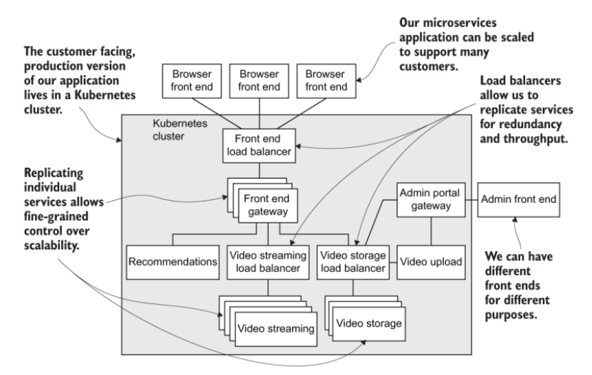
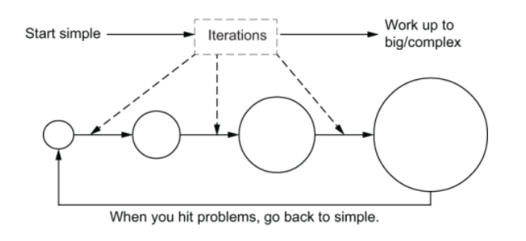
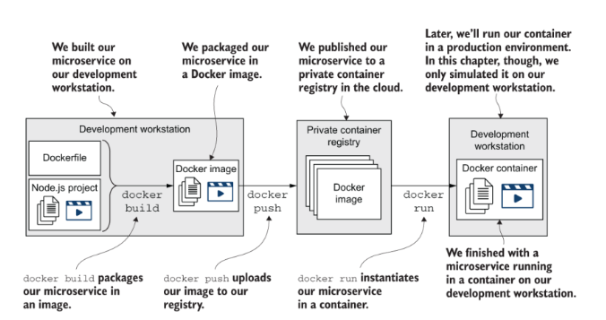
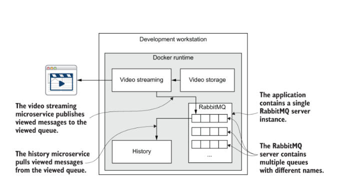
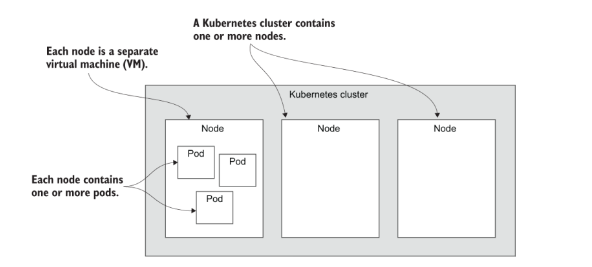
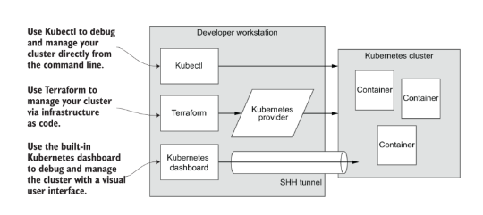
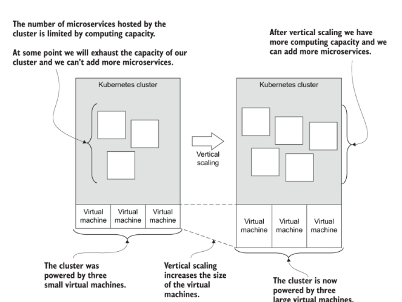
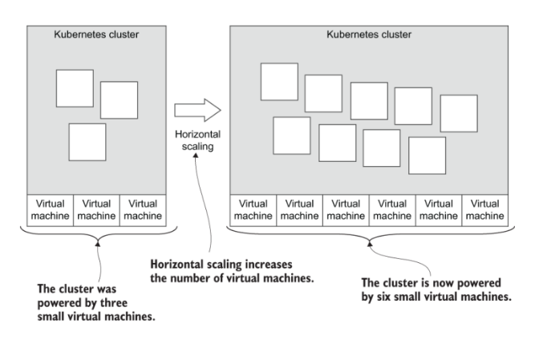
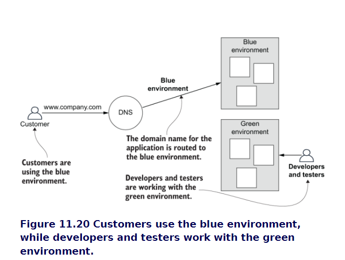
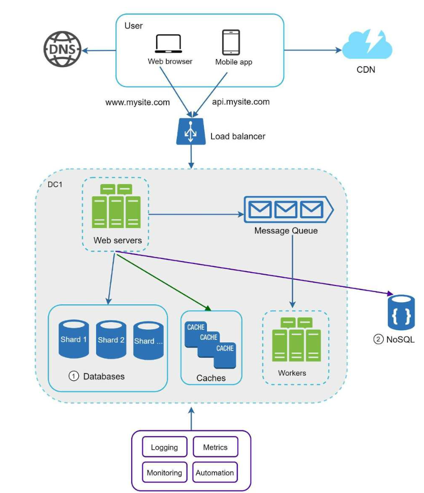

### What is a microservice?

A microservice is a tiny and independent softwareprocess that runs on its own deployment schedule and can be updatedindependently

Let’s break that definition down. A microservice is a small,independent software process that has its own separatedeployment frequency. That is to say that it must be possibleto update each microservice independently from othermicroservices

A microservice can be owned and operated either by a singledeveloper or a team of developers. A developer or teammight also manage multiple other microservices. Eachdeveloper/team has the responsibility for the microservice(s)they own. In the modern world of programming, this oftenincludes development, testing, deployment, and operations

- Docker —To package and deploy our services
- Docker Compose —To test our microservices applicationon our development workstation
- Kubernetes —To host our application in the cloud
- Terraform —To build our cloud infrastructure, ourKubernetes cluster, and deploy our application

Rules aside, let’s briefly discussthree principles that seem particularly relevant tomicroservices:
- Single responsibility principle
- Loose coupling
- High cohesion


### Designing distributed applications (domain driven design (DDD))




### Private Register vs Docker Hub

```shell
docker login <your-registry-url> --username <username> --password <password>
```

Before we can publish our image to the registry, we must tellDocker where the image is being pushed. We do this bytagging the image with the URL of the registry with thecommand docker tag as follows:

```shell
docker tag  name-image <your-registry-url>/path
```

```shell
docker push <your-registry-url>/path
```



### Methods of communicationfor microservices
`direct messaging` and `indirect messaging`, also commonly known as `synchronous` and `asynchronous communication`

1. Directmessaging simply means that one microservicedirectly sends a message to another microservice and thenreceives an immediate and direct response. Directmessaging is used when we’d like one microservice todirectly message a particular microservice and immediatelyinvoke an action or task within it
   
2. `Indirect messaging` introduces an intermediary between the endpoints in the communication process. We add amiddleman to sit between our microservices. For that reason,the two parties of the communication don’t actually have to know about each other. This style of communication resultsin a much looser coupling between our microservices. It means two things:
   - Messages are sent via an intermediary so that both sender and receiver of the messages don’t know which other microservice is involved. In the case of the sender,it doesn’t even know if any other microservice willreceive the message at all!
   - Because the receiver doesn’t know which microservice has sent the message, it can’t send a direct reply. This means that this style of communication can’t be appliedin situations where a direct response is required forconfirming success or failure

```note
A key question with microservices communication is how dowe direct a message to another microservice? The simplestanswer to this question is the ubiquitous DNS, whichtranslates hostnames to IP addresses. This worksautomatically with Docker Compose (the container name isthe hostname) and doesn’t require much effort to have itwork within our production Kubernetes cluster
```


RabbitMQ allows us to decouple message senders from message receivers. A sender doesn’t know which, if any, other microservices will handle a message
- single-recipient messages
- Multiple-recipient messages (To make this work with RabbitMQ, we must now use amessage exchange)

### Docker compose

Các container trong Docker Compose có thể giao tiếp với nhau thông qua mạng nội bộ của Docker Compose. Khi bạn định nghĩa các dịch vụ trong Docker Compose, chúng sẽ tự động được gắn vào cùng một mạng nội bộ và có thể giao tiếp với nhau bằng tên dịch vụ.

Khi container A cần giao tiếp với container B trong Docker Compose, bạn có thể sử dụng tên dịch vụ của container B như là địa chỉ để giao tiếp. Ví dụ, nếu bạn có container A và container B trong cùng một Docker Compose file, container A có thể gọi container B bằng tên của nó, ví dụ: http://ten_dich_vu.

Khi container A gửi một yêu cầu HTTP đến http://ten_dich_vu, Docker Compose sẽ định tuyến yêu cầu đến container B theo tên dịch vụ. Điều này cho phép các container trong Docker Compose giao tiếp với nhau bằng cách sử dụng tên dịch vụ thay vì địa chỉ IP cụ thể.

Quan trọng là đảm bảo rằng container A và container B đang chạy cùng trong cùng một mạng nội bộ của Docker Compose và được đặt tên đúng trong Docker Compose file để có thể giao tiếp với nhau bằng tên dịch vụ.

### Kubernetes

Kubernetes is commonly known as a container orchestration platform. Thistells us all we need to know. Kubernetes can manage and automate thedeployment and scaling of our containers. Kubernetes is the productionbackbone of our microservices application. I like to think of it as a platform formicroservices

#### How does Kubernetes work?


### Creating infrastructure withTerraform

we’ll use infrastructure as code to automate the process ofinfrastructure creation and, hence, make it reliable and repeatable.Automation allows us to later scale up our application without scaling up ourmanual workload. We’ll do this with Terraform, an amazingly flexible tool forexecuting Hashicorp Configuration Language (HCL) code

```shell
wget -O- https://apt.releases.hashicorp.com/gpg | sudo gpg --dearmor -o /usr/share/keyrings/hashicorp-archive-keyring.gpg
echo "deb [signed-by=/usr/share/keyrings/hashicorp-archive-keyring.gpg] https://apt.releases.hashicorp.com $(lsb_release -cs) main" | sudo tee /etc/apt/sources.list.d/hashicorp.list
sudo apt-add-repository "deb [arch=amd64] https://apt.releases.hashicorp.com buster main"
sudo apt update && sudo apt install terraform
```


When you invoke aks get-credentials, be sure to replace both instancesof flixtube with the name of your own application. This is the name thatyou set for your app_name variable back in section 6.10. Invoke thecommand according to this template:
```shell
az aks get-credentials --resource-group <your-app-name> ➥-name <your-app-name>
terraform apply -var="client_id=a2016492-068c-4f37-a32b-6e6196b65488" -var="client_secret=deb781f5-29e7-42c7-bed8-80781411973a" -auto-approve
```

### Scale 





Shared Database seever
Elastic scaling for the cluster

Moving into even more advanced territory, we can now thinkabout elastic scaling, which is a technique where weautomatically and dynamically scale our cluster to meetvarying levels of demand. At periods of low demand,Kubernetes can automatically deallocate resources thataren’t needed. At periods of high demand, it can allocatenew resources to meet the increased load. This makes forsubstantial cost savings because, at any given moment, weonly pay for the resources that we need to handle the loadon our application at that time. 

Blue_Green ENV




• Keep web tier stateless  
• Build redundancy at every tier  
• Cache data as much as you can• Support multiple data centers  
• Host static assets in CDN  
• Scale your data tier by sharding  
• Split tiers into individual services  
• Monitor your system and use automation tools


