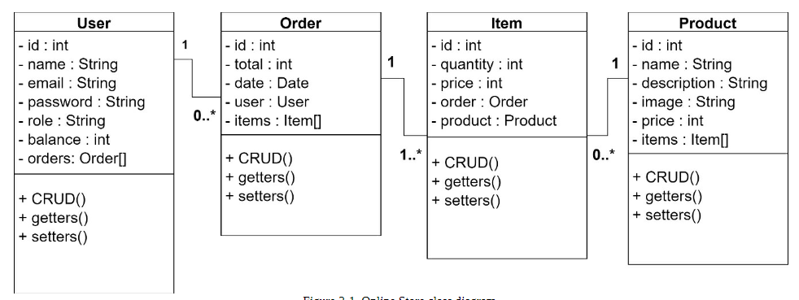

<h1>  Design </h1>

TIP: Designing a class diagram before starting to code helps us understand the application’sscope and identify important data

<h1>Nest vs Express</h1>

Both  Nest  and  Express  are  used  to  develop  server-side  applications.  The  main  difference  is  that  Express  is  aminimalist framework which does not provide a predefined architecture. Instead, Nest provides an out-of-the-boxapplication architecture which allows developers and teams to create highly testable, scalable, loosely coupled, andeasily maintainable applications. The Nest architecture is heavily inspired by Angular.

<h1>Create a new Nest project</h1>

`npm install -g @nestjs/cli`

To create a Nest project, open your Terminal, and in a location of your choice, execute the following command.Execute in Terminal:  

`nest new online-store`

The `npm run start:dev` launches the server and watches your files. It rebuilds the app as you make changes to thosefiles. This is the command that we will use from now. Otherwise, we will need to stop and start the server each timewe have a code change

Model-view-controller (MVC)  is  a  software  architectural  pattern  commonly  used  to  develop  web  applicationscontaining user interfaces. This pattern divides the application into three interconnected elements.

- Model contains the business logic of the application. For example, the online store application product dataand its functions.
- View contains the user interface of the application. For example, a view to register products or users.
- Controller acts as an interface between model and view elements. For example, a product controller collectsinformation from a “create product” view and passes it to the product model to be stored in the database