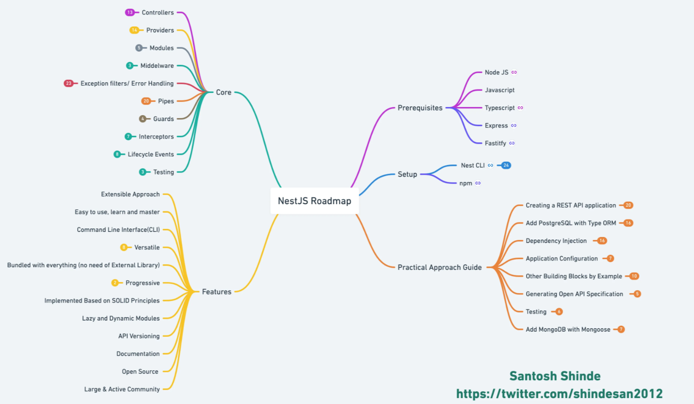
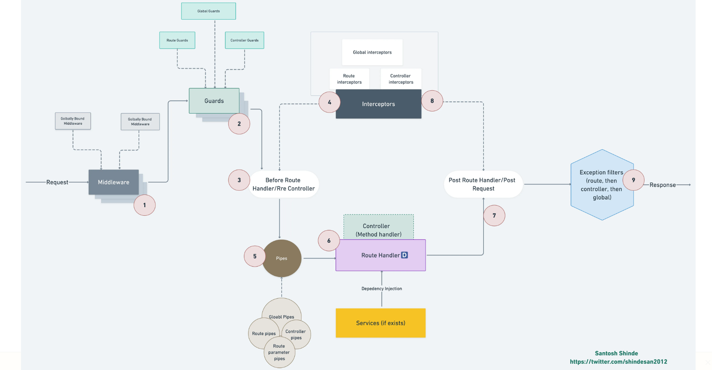
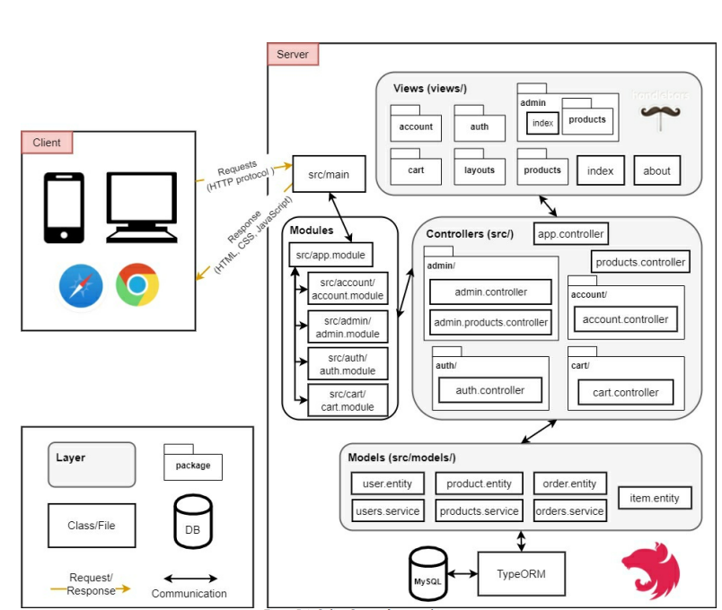

### NestJS roadmap



https://whimsical.com/nestjs-roadmap-ULJDxUceE9WbfYQ3ckPmwm

### Nest JS Request & Response Lifecycle 



### Nest JS Lifecycle Events


Dưới đây là một bảng cheat sheet cho Nest.js, cung cấp một số thông tin quan trọng về các thành phần và tính năng chính của Nest.js:

| Thành phần/Tính năng     | Mô tả                                                                                     |
|--------------------------|------------------------------------------------------------------------------------------|
| Module                   | Cơ sở của Nest.js, cung cấp tổ chức ứng dụng thành các module độc lập.                       |
| Controller               | Xử lý các yêu cầu HTTP và xác định các điểm cuối (endpoints) API.                            |
| Service                  | Điều khiển logic nghiệp vụ, thực hiện các thao tác tương tác với cơ sở dữ liệu hoặc bên ngoài. |
| Provider                 | Cung cấp các dependency cho module, như service, repository, và các instance khác.          |
| Middleware               | Xử lý các yêu cầu trước khi đi vào controller, sử dụng để thực hiện logic chung.              |
| Guard                    | Kiểm tra và xác thực quyền truy cập vào các route của ứng dụng.                                |
| Interceptor              | Xử lý và chuyển đổi dữ liệu trước và sau khi gửi yêu cầu, giúp tạo middleware toàn cục.       |
| Exception Filter         | Xử lý các ngoại lệ xảy ra trong ứng dụng và trả về phản hồi lỗi phù hợp.                        |
| Pipe                     | Kiểm tra và chuyển đổi dữ liệu được gửi đến các controller trước khi xử lý.                    |
| Decorator                | Mở rộng chức năng của một class hoặc phương thức, giúp gắn kết metadata với đối tượng.         |
| Dependency Injection     | Kỹ thuật cho phép quản lý và cung cấp các dependency giữa các thành phần của ứng dụng.        |
| Data Transfer Object (DTO)| Đối tượng dùng để truyền dữ liệu giữa client và server, thường được sử dụng trong API.         |
| TypeORM                   | Một ORM (Object-Relational Mapping) được hỗ trợ bởi Nest.js để làm việc với cơ sở dữ liệu SQL. |
| Mongoose                 | Một thư viện ODM (Object Data Modeling) để làm việc với cơ sở dữ liệu MongoDB.               |
| Swagger                  | Một công cụ tạo tài liệu API tự động và thử nghiệm các endpoint.                                |
| Testing (Jest)           | Jest là một framework thử nghiệm được tích hợp sẵn trong Nest.js, hỗ trợ viết test dễ dàng.   |

Dưới đây là một bảng liệt kê các decorator phổ biến trong Nest.js cùng với mô tả ngắn gọn về chức năng của mỗi decorator:

| Decorator             | Mô tả                                                                                                                             |
|-----------------------|----------------------------------------------------------------------------------------------------------------------------------|
| @Module               | Đánh dấu một class là một module của Nest.js.                                                                                    |
| @Controller           | Đánh dấu một class là một controller, xử lý các yêu cầu HTTP và định nghĩa các điểm cuối API.                                     |
| @Injectable           | Đánh dấu một class là một service, có thể được chú thích với `@Injectable()` để sử dụng dependency injection.                      |
| @Inject               | Được sử dụng trong constructor của một class để chú thích rằng một dependency cần được inject vào biến có chú thích với @Inject.    |
| @Param                | Được sử dụng để inject giá trị của một route parameter vào một endpoint trong một controller.                                  |
| @Body                 | Được sử dụng để inject dữ liệu trong phần body của một yêu cầu HTTP vào một endpoint trong một controller.                      |
| @Query                | Được sử dụng để inject dữ liệu từ query parameters của một yêu cầu HTTP vào một endpoint trong một controller.                 |
| @Headers              | Được sử dụng để inject giá trị của các headers trong một yêu cầu HTTP vào một endpoint trong một controller.                    |
| @Res                  | Được sử dụng để inject đối tượng Response của Express vào một endpoint trong một controller.                                     |
| @Req                  | Được sử dụng để inject đối tượng Request của Express vào một endpoint trong một controller.                                      |
| @UseGuards            | Chú thích một controller hoặc một endpoint để áp dụng một hoặc nhiều guards (kiểm tra quyền truy cập) trước khi xử lý.           |
| @UseFilters           | Chú thích một controller hoặc một endpoint để áp dụng một hoặc nhiều exception filters (bộ lọc ngoại lệ) trước khi xử lý.      |
| @UseInterceptors      | Chú thích một controller hoặc một endpoint để áp dụng một hoặc nhiều interceptors (bộ chặn) trước và sau khi xử lý.              |
| @UsePipes             | Chú thích một controller hoặc một endpoint để áp dụng một hoặc nhiều pipes (bộ chuyển đổi) trước khi xử lý.                     |
| @SetMetadata          | Được sử dụng để gắn metadata (siêu dữ liệu) với một controller hoặc một phương thức trong một controller.                       |
| @HttpCode             | Chú thích một phương thức trong một controller để chỉ định


#### MVC NestJS

Trong NestJS, mô hình kiến trúc mặc định được khuyến nghị là mô hình MVC (Model-View-Controller) và mô hình DDD (Domain-Driven Design). Trong mô hình này, có ba thành phần chính: module, controller và service. Dưới đây là giải thích dễ hiểu và chi tiết cho từng thành phần này:

1. Module:
   - Module là một phần của ứng dụng NestJS, đảm nhiệm việc tổ chức và phân chia các thành phần logic của ứng dụng thành các phạm vi độc lập và tái sử dụng.
   - Module chứa các controller, service và các thành phần khác cần thiết như providers, repositories, middleware, v.v.
   - Module giúp tạo ra một cầu nối giữa các thành phần khác nhau của ứng dụng và xác định các phạm vi (scope) của các thành phần.
   - Mỗi ứng dụng NestJS cần ít nhất một module gốc (root module) để bắt đầu quá trình khởi tạo ứng dụng.

2. Controller:
   - Controller là thành phần xử lý các yêu cầu HTTP và xác định các endpoint (đường dẫn URL) và phương thức HTTP (GET, POST, PUT, DELETE, v.v.).
   - Controller nhận yêu cầu từ client, gọi các phương thức tương ứng của service và trả về kết quả cho client.
   - Mỗi controller chịu trách nhiệm cho một phần của ứng dụng và có thể có nhiều phương thức xử lý khác nhau.

3. Service:
   - Service là thành phần chịu trách nhiệm xử lý logic kinh doanh (business logic) của ứng dụng.
   - Service thực hiện các nhiệm vụ cụ thể như truy xuất cơ sở dữ liệu, xử lý dữ liệu, gọi API bên ngoài, v.v.
   - Service thường được gọi bởi controller để xử lý các yêu cầu và trả về kết quả cho controller.
   - Mỗi service chịu trách nhiệm cho một phần logic kinh doanh cụ thể của ứng dụng.

Tóm lại, module trong NestJS giúp tổ chức và phân chia ứng dụng thành các phạm vi độc lập, controller xử lý yêu cầu và trả về kết quả cho client, và service chịu trách nhiệm xử lý logic kinh doanh của ứng dụng. Các thành phần này cùng hoạt động để xây dựng ứng dụng NestJS có cấu trúc rõ ràng, dễ quản lý và dễ m

#### Deoendency Inection

Dependency Injection (DI) là một nguyên tắc thiết kế phần mềm quan trọng trong NestJS và nhiều framework khác. Nó giúp tách biệt các thành phần trong ứng dụng và giảm sự phụ thuộc giữa chúng, làm cho mã nguồn dễ đọc, kiểm thử và bảo trì hơn.

Giải thích DI dễ hiểu nhất:
DI có thể được hiểu như việc "đưa những gì bạn cần" đến một thành phần thay vì nó tự tạo ra hoặc biết cách lấy nó. Thay vì tạo mới một đối tượng hoặc truy cập trực tiếp vào một đối tượng khác, DI cho phép bạn khai báo các phụ thuộc của một thành phần và framework sẽ quản lý việc tạo và cung cấp các đối tượng phụ thuộc đó cho bạn.

Ví dụ thực tiễn:
Xét ví dụ một ứng dụng NestJS đơn giản có một service `UserService` và một controller `UserController` sử dụng service này.

1. Khai báo service:
```typescript
@Injectable()
export class UserService {
  getUsers(): string[] {
    return ['Alice', 'Bob', 'Charlie'];
  }
}
```

2. Khai báo controller và sử dụng service thông qua DI:
```typescript
@Controller('users')
export class UserController {
  constructor(private readonly userService: UserService) {}

  @Get()
  getUsers(): string[] {
    return this.userService.getUsers();
  }
}
```

Ở đây, chúng ta đã sử dụng DI để cung cấp một thể hiện của `UserService` cho `UserController`. Như vậy, `UserController` không cần biết cách tạo mới `UserService`, mà chỉ cần yêu cầu nó thông qua constructor.

Khi NestJS khởi tạo ứng dụng, nó sẽ tự động tạo mới một thể hiện của `UserService` và cung cấp cho `UserController` thông qua DI. Điều này giúp chúng ta tách biệt và tái sử dụng các thành phần, và cũng làm cho việc kiểm thử dễ dàng hơn bằng cách cung cấp các mock object thay thế cho các phụ thuộc.

Qua ví dụ trên, bạn có thể thấy rằng DI trong NestJS giúp giảm sự phụ thuộc giữa các thành phần và làm cho mã nguồn dễ đọc, kiểm thử và bảo trì hơn.

