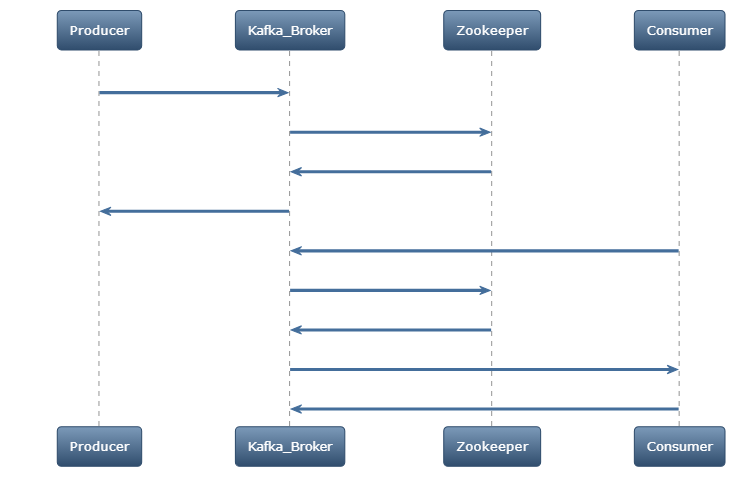
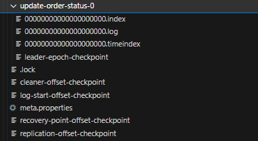

### Kiến trúc và các thành phần của Kafka

#### Thành phần chính:
1. **Producer**: Đây là thành phần sinh ra dữ liệu và gửi nó đến các Topic trong Kafka.
2. **Consumer**: Thành phần này đọc dữ liệu từ các Topic mà nó đăng ký.
3. **Broker**: Đây là nút trong Kafka, quản lý việc lưu trữ, nhận và gửi tin nhắn.
4. **Zookeeper**: Được sử dụng để quản lý và cân nhắc các Broker trong Kafka.
5. **Topic**: Là một danh mục cụ thể mà Producer gửi tin nhắn và Consumer đọc tin nhắn.
6. **Partition**: Topic có thể được chia thành nhiều phần nhỏ hơn, được gọi là Partition.
7. **Replica**: Là bản sao của Partition, giúp tăng độ tin cậy và khả năng chịu đựng lỗi.

#### Kafka giải quyết vấn đề gì?
1. **Xử lý dữ liệu thời gian thực**: Kafka có khả năng xử lý dữ liệu trong thời gian thực.
2. **Độ tin cậy cao**: Với các cơ chế như Replica, Kafka có độ tin cậy và khả năng chịu đựng lỗi rất cao.
3. **Khả năng mở rộng**: Có thể dễ dàng thêm Broker vào một cụm Kafka.
4. **Độ trễ thấp**: Kafka được thiết kế để có độ trễ thấp trong việc xử lý dữ liệu.
   

1. **Producer (P)**: Đây là thành phần sinh ra dữ liệu. Trong biểu đồ, Producer gửi một tin nhắn đến Kafka Broker (KB) với hành động "Produce Message".

2. **Kafka Broker (KB)**: Đây là nút quản lý trong Kafka. Khi nhận được tin nhắn từ Producer, Broker đăng ký Topic và Partition tương ứng với Zookeeper (ZK) qua hành động "Register Topic & Partition".

3. **Zookeeper (ZK)**: Zookeeper xác nhận việc đăng ký Topic và Partition bằng cách gửi lại thông điệp "Acknowledge" cho Kafka Broker.

4. **Consumer (C)**: Consumer muốn đọc dữ liệu từ một Topic cụ thể. Để làm điều này, nó gửi yêu cầu "Subscribe to Topic" đến Kafka Broker.

5. **Kafka Broker và Zookeeper**: Khi Consumer đăng ký, Broker cần phải biết thông tin về Partition để có thể gửi dữ liệu cho Consumer. Nó thực hiện điều này bằng cách yêu cầu "Fetch Partition Info" từ Zookeeper.
   - Một Topic trong Kafka có thể được phân chia thành nhiều Partition. Mỗi Partition có thể được lưu trữ trên một Broker khác nhau. Do đó, để gửi dữ liệu đến Consumer, Broker cần phải xác định Partition nào đang chứa dữ liệu mà Consumer muốn đọc.
   - Load Balancing: Việc biết rõ thông tin về Partition giúp Broker có thể cân nhắc tải hiệu quả hơn. Nó có thể quyết định gửi các yêu cầu đọc từ các Consumer đến các Partition sao cho tải được phân phối đều giữa các Broker.
   - Khả Năng Chịu Đựng Lỗi: Khi một Broker gặp sự cố, việc biết rõ thông tin về Partition giúp Kafka nhanh chóng chuyển các yêu cầu đến các Broker khác đang giữ các Replica của Partition đó.

6. **Zookeeper**: Gửi thông tin về Partition đến Kafka Broker qua thông điệp "Send Partition Info".

7. **Kafka Broker và Consumer**: Sau khi có thông tin về Partition, Broker gửi tin nhắn đến Consumer qua hành động "Send Message". Consumer sau đó xác nhận đã nhận được tin nhắn qua thông điệp "Acknowledge".
   - Consumer Group: Trong một nhóm Consumer, mỗi Consumer có thể đọc dữ liệu từ một hoặc nhiều Partition. Việc này đòi hỏi Broker phải biết rõ thông tin về Partition để có thể phân chia dữ liệu đến các Consumer một cách hiệu quả.
   - Offset Management: Mỗi tin nhắn trong một Partition có một chỉ số duy nhất gọi là Offset. Broker sử dụng thông tin này để theo dõi vị trí hiện tại của mỗi Consumer, giúp hỗ trợ việc đọc dữ liệu tuần tự và xử lý dữ liệu trong trường hợp có sự cố.

### Thành Phần Con của Topic trong Kafka

Một Topic trong Kafka có thể được chia thành các thành phần con chính sau:

1. **Partitions**: Mỗi Topic có thể được phân chia thành nhiều Partition. Partition là đơn vị cơ bản để lưu trữ và phân phối dữ liệu.
   - Partition: Mỗi Partition thực chất là một tập tin log phân tán, và nó được lưu trữ trên một Broker cụ thể. Một Partition có thể có một hoặc nhiều Replica.

   - Replica: Các Replica của một Partition cũng được lưu trữ trên các Broker khác nhau trong cụm. Một trong các Replica này sẽ được chọn làm Leader, và các Replica còn lại là Follower.
   - 
    

2. **Replicas**: Mỗi Partition có thể có một hoặc nhiều Replica để đảm bảo tính sẵn sàng và độ tin cậy của dữ liệu.

3. **Leader và Follower**: Trong các Replica của một Partition, có một Replica được chọn làm Leader, còn lại là Follower. Leader là nơi xử lý tất cả các yêu cầu đọc và ghi, trong khi Follower chỉ đồng bộ dữ liệu từ Leader.

4. **Offset**: Mỗi tin nhắn trong Partition được đánh dấu bằng một chỉ số duy nhất gọi là Offset. 

5. **Consumer Groups**: Một hoặc nhiều Consumer có thể đăng ký nhận dữ liệu từ các Partition của một Topic. Các Consumer này thường được tổ chức thành các nhóm (Consumer Groups) để cân nhắc tải và xử lý dữ liệu hiệu quả.

#### Sequence Diagram

[Bạn có thể xem biểu đồ này trong một tab mới.](https://showme.redstarplugin.com/d/d:5xIbSvTq)

[Bạn cũng có thể chỉnh sửa biểu đồ này nếu muốn thay đổi chi tiết.](https://showme.redstarplugin.com/s/s:dawfkYGm)

Biểu đồ trên mô tả quá trình từ khi Producer đăng tin nhắn vào Topic cho đến khi các Consumer nhận và xác nhận tin nhắn từ các Partition tương ứng.

Example:

### Sequence Diagram Chi Tiết

- [Bạn có thể xem biểu đồ này trong một tab mới.](https://showme.redstarplugin.com/d/d:P5cEcIgc)
- [Bạn có thể chỉnh sửa biểu đồ này nếu muốn thay đổi.](https://showme.redstarplugin.com/s/s:JfEFWj9N)

**Loại biểu đồ**: Sequence Diagram trong ngôn ngữ Mermaid

#### Giải thích Sequence Diagram
1. **Server1 (S1)**: Server 1 cập nhật 20 đơn hàng trong cơ sở dữ liệu MongoDB1 (DB1).
2. **Producer (P)**: Server 1 gửi 20 thông điệp đến Kafka thông qua Producer.
3. **Broker1, Broker2, Broker3 (B1, B2, B3)**: Producer đăng thông điệp lên các Broker.
4. **Partition1, Partition2, Partition3, Partition4, Partition5 (PT1, PT2, PT3, PT4, PT5)**: Các Broker lưu thông điệp vào các Partition tương ứng.
5. **Consumer (C)**: Các Partition thông báo có thông điệp mới, và Consumer (ở Server 2) tiến hành đọc thông điệp.
6. **Server2 (S2)**: Server 2 cập nhật 20 đơn hàng trong cơ sở dữ liệu MongoDB2 (DB2).

Lưu ý: 20 đơn hàng được cập nhật.
 

Khi cài đặt Kafka trên một máy EC2 với 4 core CPU và 8GB RAM, có một số yếu tố cần xem xét:

### Tài nguyên Hệ thống:

1. **CPU**: 4 core là đủ để xử lý các tác vụ cơ bản của Kafka. Tuy nhiên, nếu bạn có nhu cầu cao về throughput, bạn có thể cần phải mở rộng.

2. **RAM**: 8GB RAM có thể là đủ cho một cài đặt Kafka nhỏ, nhưng nếu bạn có nhiều partition, topic, và consumer, bạn có thể cần nhiều RAM hơn.

### Cấu hình Kafka:

1. **Heap Size**: Mặc định, Kafka sử dụng 1GB heap memory. Trong trường hợp của bạn, có thể cân nhắc tăng giá trị này lên 4GB hoặc 6GB.

2. **Log Retention**: Để tiết kiệm không gian đĩa và RAM, cấu hình thời gian hoặc kích thước lưu trữ log phù hợp.

3. **Number of Brokers**: Với 4 core, việc chạy nhiều broker trên cùng một máy có thể không hiệu quả. Tốt nhất là chỉ chạy một broker trên một máy EC2 này.

4. **Replication Factor**: Để đảm bảo tính sẵn sàng và độ tin cậy, sử dụng ít nhất 3 broker trên các máy EC2 khác nhau với replication factor là 3.

5. **Consumer Groups**: Nếu có nhiều consumer, sử dụng consumer groups để cải thiện hiệu suất và quản lý tài nguyên tốt hơn.

6. **Monitoring**: Sử dụng công cụ giám sát như Prometheus hoặc Grafana để theo dõi hiệu suất và tài nguyên.

### Tối ưu Hóa Hệ Thống:

1. **Network**: Đảm bảo rằng máy EC2 có bandwidth đủ để xử lý lượng dữ liệu.

2. **Storage**: Sử dụng EBS với IOPS cao nếu bạn cần throughput đĩa cao.

3. **OS Tuning**: Tối ưu hóa các tham số hệ thống như số lượng file descriptor và kích thước socket buffer.

Tóm lại, cấu hình này có thể phục vụ tốt cho môi trường phát triển hoặc kiểm tra, nhưng nếu bạn đang xem xét việc sử dụng Kafka trong môi trường sản xuất với yêu cầu cao về hiệu suất và độ tin cậy, việc sử dụng máy EC2 với cấu hình tài nguyên cao hơn hoặc thêm nhiều máy EC2 vào cluster của bạn có thể là một lựa chọn tốt hơn.

Bandwidth là khả năng của một đường truyền mạng trong việc truyền dữ liệu từ điểm này đến điểm khác trong một đơn vị thời gian cụ thể, thường được đo bằng bit mỗi giây (bps). Trong ngữ cảnh của Kafka và các ứng dụng phân tán khác, bandwidth có một số ý nghĩa quan trọng:

### Tại sao Bandwidth Quan Trọng:

1. **Hiệu Suất**: Bandwidth cao giúp Kafka broker nhanh chóng nhận và gửi dữ liệu, giảm độ trễ và tăng throughput.

2. **Độ Tin Cậy**: Nếu bandwidth không đủ, có thể xảy ra tình trạng "bottleneck" trong hệ thống, dẫn đến việc tăng độ trễ và có thể làm mất dữ liệu.

3. **Phân Tán Dữ Liệu**: Trong một hệ thống Kafka có nhiều broker và partition, việc phân tán dữ liệu đều đặn giữa các broker phụ thuộc nhiều vào bandwidth.

4. **Replication**: Việc sao chép dữ liệu giữa các broker cũng cần đến bandwidth đáng kể, đặc biệt khi có sự cố và cần phải phục hồi dữ liệu.

### Cách Tối Ưu Bandwidth:

1. **Monitoring**: Sử dụng các công cụ giám sát như Prometheus, Grafana để theo dõi bandwidth hiện tại và cảnh báo khi có vấn đề.

2. **Load Balancing**: Sử dụng các thuật toán cân bằng tải để phân phối dữ liệu đều giữa các broker.

3. **Compression**: Kafka hỗ trợ nén dữ liệu, giúp giảm lượng dữ liệu cần truyền và do đó giảm yêu cầu về bandwidth.

4. **Network Isolation**: Phân loại và ưu tiên traffic để đảm bảo rằng Kafka luôn có đủ bandwidth.

5. **Scale Out**: Nếu cần, bạn có thể thêm nhiều broker vào cluster để tăng bandwidth tổng cộng của hệ thống.

6. **Tuning OS và Network**: Tối ưu hóa các tham số mạng ở cấp độ HĐH có thể giúp cải thiện bandwidth.

Trong môi trường cloud như EC2, bạn cũng cần xem xét loại instance và các tùy chọn mạng để đảm bảo rằng bạn có đủ bandwidth cho các yêu cầu của mình.

