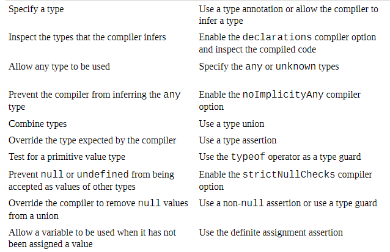
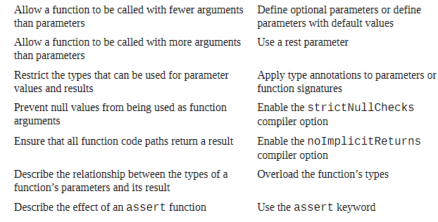
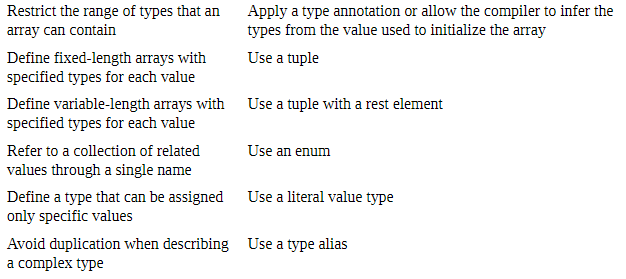
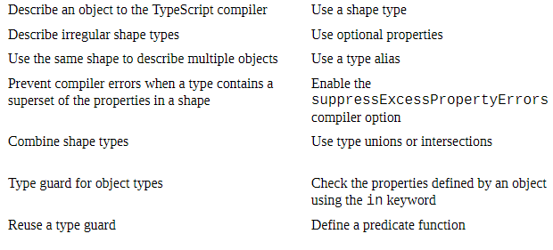
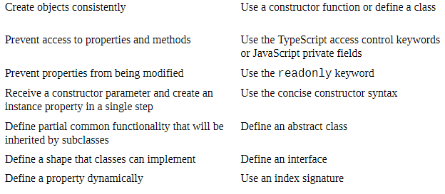
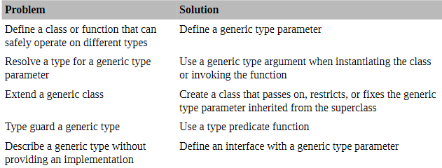
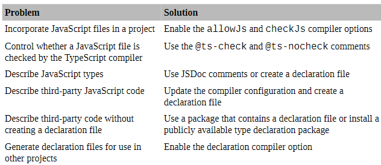
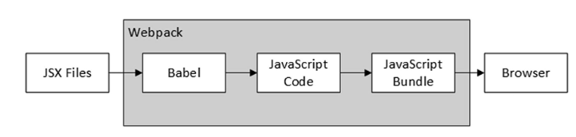
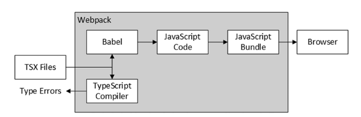

Ref: Essential TypeScript 4
### What is Typescript
 
TypeScript is a strongly typed programming language that builds on JavaScript, giving you better tooling at any scale

Created by Microsoft in the year 2012

#### Init

```shell
tsc --init
```

#### Watch

```shell
tsc -w
```

### Understanding Static Types

 

#### Using Type Union:
```ts
let taxNumber: string | number  = calculateTax(100,false);
```

#### Using Type Assertions
```ts
let taxNumber = calculateTax(100, false) as number;

let taxNumber = <number> calculateTax(100, false);
```

#### Using a Type Guard
```ts
typeof taxValue === "number"
```

#### Understanding the Never Type

Something has gone wrong if execution reaches the default clause of theswitch statement, and TypeScript provides the never type to ensure you can’taccidentally use a value once type guards have been used to exhaustively narrowa value to all of its possible types

```ts
let taxValue = calculateTax(100, false);
switch (typeof taxValue) {
  case "number":
    console.log(`Number Value:
  ${taxValue.toFixed(2)}`);
    break;
  case "string":
    console.log(`String Value:
  ${taxValue.charAt(0)}`);
    break;
  default:
    let value: never = taxValue;
    console.log(`Unexpected type for value: ${value}`);
}
```

#### Using the unknown Type

```ts
let newResult: unknown = calculateTax(200, false);
let myNumber: number = newResult;
console.log(`Number value: ${myNumber.toFixed(2)}`);
```

An unknown value can’t be assigned to another type without a typeassertion, so the compiler produces the following error when it compiles the code

```shell
src/index.ts(18,5): error TS2322: Type 'unknown' isnot assignable to type 'number'.
```

Instead
```ts
let myNumber: number = newResult as number;
```
Unlike the earlier example, the unknown value is really a number, so thecode doesn’t generate a runtime error and produces the following output whenexecuted

#### Using Nullable Types

Under normal circumstances, the compiler will report an error if a value ofone type is assigned to a variable of a different type, but the compiler remainssilent because it allows null and undefined to be treated as values for alltypes

### Removing null from a Union with an Assertion

Using !
```ts
let taxValue: string | number = calculateTax(100,false)!;
```

A non-null value is asserted by applying the ! character after the value, as illustrated by Figure 7-5. The assertion in the listing tells the compiler that the result from the calculateTax function will not be null, which allows it to be assigned to the taxValue variable, whose type is string | number.

### Function

 

#### Using Optional Parameters

```ts
function calculateTax(amount, discount?) {
    return (amount * 1.2) - (discount || 0);
}
let taxValue = calculateTax(100, 0);
console.log(`2 args: ${taxValue}`);
taxValue = calculateTax(100);
console.log(`1 arg: ${taxValue}`);
```

#### Using Default Parameters

```ts
function calculateTax(amount, discount?) {
    return (amount * 1.2) - (discount || 0);
}
```

#### Using a Rest Parameter

A function can have one rest parameter only, and it must bethe last parameter

```ts
function calculateTax(amount: number, discount: number = 0, ...extraFees: number[]): number {
    return (amount * 1.2) - discount + extraFees.reduce((total, val) => total + val, 0);
}
```

#### Defining Void Functions
Functions that do not produce results are declared using the void type
```ts
function writeValue(label: string, value: number): void {
    console.log(`${label}: ${value}`);
}
writeValue("Tax value", calculateTax(100, 0));
```

#### Overloading Function Types

```ts
function calculateTax(amount: number): number;
function calculateTax(amount: null): null;
function calculateTax(amount: number | null): number | null {
    if (amount != null) {
        return amount * 1.2;
    }
    return null;
}

```

### Understanding Assert Functions

```ts
function check(expression: boolean) : asserts expression {
    if (!expression) {
        throw new Error("Expression is false");
    }
}
function calculateTax(amount: number | null): number {
    check(typeof amount == "number");
    return amount * 1.2;
}
let taxAmount: number = calculateTax(100);
console.log(`Tax value: ${taxAmount}`)
```

### Using Arrays, Tuples, and Enums

 

#### Working with Arrays

Syntax
```ts
let prices: number[] = [100, 75, 42];
let prices: Array<number> = [100, 75, 42];
```

```ts
let prices: number[] = [100, 75, 42];
let names: string[] = ["Hat", "Gloves", "Umbrella"];
```

```ts
function calculateTax(amount: number): number {
    return amount * 1.2;
}
function writePrice(product: string, price: number):
    void {
    console.log(`Price for ${product}:
    $${price.toFixed(2)}`);
}
let prices = [];
prices.push(...[100, 75, 42, "20"]);

let names = ["Hat","Gloves","Umbrella","Sunglasses"];
prices.forEach((price, index) => {
    writePrice(names[index], calculateTax(price));
});
```

Trong đoạn mã bạn đã đưa ra, khi bạn gọi hàm calculateTax trong hàm writePrice, giá trị cuối cùng của mảng prices là một chuỗi được gán cho tham số price.

Trong TypeScript, khi bạn khai báo một mảng với kiểu dữ liệu cụ thể, như number[], TypeScript sẽ cố gắng kiểm tra và đảm bảo rằng các phần tử trong mảng đó đều có kiểu dữ liệu tương ứng. Tuy nhiên, trong trường hợp bạn sử dụng toán tử spread (...) để gán các phần tử vào mảng prices, TypeScript không thể áp dụng kiểm tra kiểu dữ liệu chi tiết cho các phần tử được gán vào mảng.

#### Working with Tuples

Basic tuples are fixed-length arrays, where each element in the array can have adifferent type. Tuples are a data structure that is provided by the TypeScriptcompiler implemented using regular JavaScript arrays in the compiled code

```ts
let hat: [string, number] = ["Hat", 100];
```

#### Using Tuple Types

Tuples have a distinct type that can be used just like any type, which means youcan create arrays of tuples, use tuples in type unions, and use type guards tonarrow values to specific tuple types

```ts
function calculateTax(amount: number): number {
  return amount * 1.2;
}

function writePrice(product: string, price: number): void {
  console.log(`Price for ${product}: $${price.toFixed(2)}`);
}

let hat: [string, number] = ["Hat", 100];
let gloves: [string, number] = ["Gloves", 75];
let products: [string, number][] = [
  ["Hat", 100],
  ["Gloves", 75]
];
let tupleUnion: ([string, number] | boolean)[] = [true, false, hat, ...products];

tupleUnion.forEach((elem: [string, number] | boolean) => {
  if (elem instanceof Array) {
    let [str, num] = elem;
    console.log(`Name: ${str}`);
    console.log(`Price: ${num.toFixed(2)}`);
  } else if (typeof elem === "boolean") {
    console.log(`Boolean Value: ${elem}`);
  }
});
```

#### Using Tuples with Optional Elements

```ts
let hat: [string, number, number?] = ["Hat", 100];
let gloves: [string, number, number?] = ["Gloves", 75,10];
```

#### Defining Tuples with Rest Elements

```ts
let hat: [string, number, number?, ...number[]] = ["Hat", 100, 10, 1.20, 3, 0.95];
```

#### Limitation of Enum

Understanding the Value-Checking Limitation

```ts
function calculateTax(amount: number): number {
    return amount * 1.2;
}

function writePrice(product: string, price: number): void {
    console.log(`Price for ${product}:
    $${price.toFixed(2)}`);
}

enum OtherEnum {
    First = 10,
    Two = 20
}

enum Product {
    Hat = OtherEnum.First + 1,
    Gloves = 20,
    Umbrella = Hat + Gloves
}

let productValue: Product = 0;
let productName: string = Product[productValue];
console.log(`Value: ${productValue}, Name:
    ${productName}`);

enum City {
    London = "London",
    Paris = "Paris",
    NY = "New York"
}
```

Output:11 20 31, 0 not value of Product
```ts
index.ts(21,5): error TS2322: Type '0' is not assignable to type 'Product'.
```

Understanding the Type Guard Limitation: 

không thể dùng typeof để phân enum và number được

```ts
function calculateTax(amount: number): number {
    return amount * 1.2;
}

function writePrice(product: string, price: number): void {
    console.log(`Price for ${product}: $${price.toFixed(2)}`);
}

enum OtherEnum {
    First = 10,
    Two = 20
}

enum Product {
    Hat = OtherEnum.First + 1,
    Gloves = 20,
    Umbrella = Hat + Gloves
}

let productValue: Product = Product.Hat;
if (typeof productValue === "number") {
    console.log("Value is a number");
}

let unionValue: number | Product = Product.Hat;
if (typeof unionValue === "number") {
    console.log("Value is a number");
}

// Value is a number
// Value is a number
```

### Working with Objects

 

#### Working with Objects

JavaScript objects are collections of properties that can be created using theliteral syntax, constructor functions, or classes.

To provide type features forobjects, TypeScript focuses on an object’s “shape,” which is the combination ofits property names and types

#### Using Type Aliases for Shape Types

```ts
enum Feature {
    Waterproof,
    Insulated
}

type Product = {
    name: string,
    price?: number,
    hasFeature?(feature: Feature): boolean
};

let hat = {
    name: "Hat",
    price: 100
};

let gloves = {
    name: "Gloves",
    price: 75
};

let umbrella = {
    name: "Umbrella",
    price: 30,
    hasFeature: (feature) => feature === Feature.Waterproof
};

let products: Product[] = [hat, gloves, umbrella];

products.forEach(prod =>
    console.log(`${prod.name}: ${prod.price} ` +
    `${prod.hasFeature ? prod.hasFeature(Feature.Waterproof) : "false"}`)
);

```

#### Using Shape Type Unions

Arrays or function parameters can acceptmultiple types.

```ts
type Product = {
    id: number,
    name: string,
    price?: number
};

type Person = {
    id: string,
    name: string,
    city: string
};

let hat = { id: 1, name: "Hat", price: 100 };
let gloves = { id: 2, name: "Gloves", price: 75 };
let umbrella = { id: 3, name: "Umbrella", price: 30 };
let bob = { id: "bsmith", name: "Bob", city: "London" };

let dataItems: (Product | Person)[] = [hat, gloves, umbrella, bob];

dataItems.forEach(item =>
    console.log(`ID: ${item.id}, Name: ${item.name}`)
);

```

#### Understanding Union Property Types

```ts
type UnionType = {
  id: number | string,
  name: string
};
let dataItems: UnionType[] = [hat, gloves, umbrella, bob];
```

#### Person: Bob: LondonUsing Type Intersections

```ts
type Person = {
    id: string,
    name: string,
    city: string
};

type Employee = {
    company: string,
    dept: string
};

let bob = {
    id: "bsmith",
    name: "Bob",
    city: "London",
    company: "Acme Co",
    dept: "Sales"
};

let dataItems: (Person & Employee)[] = [bob];

dataItems.forEach(item => {
    console.log(`Person: ${item.id}, ${item.name}, ${item.city}`);
    console.log(`Employee: ${item.id}, ${item.company}, ${item.dept}`);
});

```

#### Merging Properties with Different Types
If there are properties with the same name but different types, the compiler keeps
the property name but intersects the type

```ts
type Person = {
  id: string,
  name: string,
  city: string,
  contact: number
};

type Employee = {
  id: string,
  company: string,
  dept: string,
  contact: string
};

type EmployedPerson = Person & Employee;

let typeTest = ({} as EmployedPerson).contact

// declare let typeTest: number & string;
// src/index.ts(21,40): error TS2322: Type 'string' isnot assignable to type 'never'.
```

There is noway to work around this problem for primitive types, and the only solution is toadjust the types used in the intersection so that shape types are used instead ofprimitives,

```ts
type Person = {
    id: string,
    name: string,
    city: string,
    contact: { phone: number }
};

type Employee = {
    id: string,
    company: string,
    dept: string,
    contact: { name: string }
};

type EmployedPerson = Person & Employee;

let typeTest = ({} as EmployedPerson);

let person1: EmployedPerson = {
    id: "bsmith",
    name: "Bob Smith",
    city: "London",
    company: "Acme Co",
    dept: "Sales",
    contact: {
        name: "Alice",
        phone: 6512346543
    }
};

let person2: EmployedPerson = {
    id: "dpeters",
    name: "Dora Peters",
    city: "New York",
    company: "Acme Co",
    dept: "Development",
    contact: {
        name: "Alice",
        phone: 6512346543
    }
};

```

#### Working with Classes and Interfaces

 

#### Using Constructor Functions

```ts
type Person = {
    id: string,
    name: string,
    city: string
};

type Employee = {
    id: string,
    name: string,
    dept: string,
    city: string,
    writeDept: () => void
};

let Employee = function(id: string, name: string, dept: string, city: string) {
    this.id = id;
    this.name = name;
    this.dept = dept;
    this.city = city;
};

Employee.prototype.writeDept = function() {
    console.log(`${this.name} works in ${this.dept}`);
};

let salesEmployee = new Employee("fvega", "Fidel Vega", "Sales", "Paris");

let data: (Person | Employee)[] = [
    { id: "bsmith", name: "Bob Smith", city: "London" },
    { id: "ajones", name: "Alice Jones", city: "Paris" },
    { id: "dpeters", name: "Dora Peters", city: "New York" },
    salesEmployee
];

data.forEach(item => {
    if ("dept" in item) {
        item.writeDept();
    } else {
        console.log(`${item.id} ${item.name}, ${item.city}`);
    }
});

```

#### Using Classes

```ts
// Nếu sử dụng contructor fuction thì phải thêm type vào, còn class thì k cần
type Person = {
    id: string,
    name: string,
    city: string
};

class Employee {
    id: string;
    name: string;
    dept: string;
    city: string;

    constructor(id: string, name: string, dept: string, city: string) {
        this.id = id;
        this.name = name;
        this.dept = dept;
        this.city = city;
    }

    writeDept() {
        console.log(`${this.name} works in ${this.dept}`);
    }
}

let salesEmployee = new Employee("fvega", "FidelVega", "Sales", "Paris");

let data: (Person | Employee)[] = [
    { id: "bsmith", name: "Bob Smith", city: "London" },
    { id: "ajones", name: "Alice Jones", city: "Paris" },
    { id: "dpeters", name: "Dora Peters", city: "New York" },
    salesEmployee
];

data.forEach(item => {
    if (item instanceof Employee) {
        item.writeDept();
    } else {
        console.log(`${item.id} ${item.name}, ${item.city}`);
    }
});

```

#### Using the Access Control Keywords

private, public, protected
```ts
type Person = {
    id: string,
    name: string,
    city: string
};

class Employee {
    public id: string;
    public name: string;
    private dept: string;
    public city: string;

    constructor(id: string, name: string, dept: string, city: string) {
        this.id = id;
        this.name = name;
        this.dept = dept;
        this.city = city;
    }

    writeDept() {
        console.log(`${this.name} works in ${this.dept}`);
    }
}

let salesEmployee = new Employee("fvega", "FidelVega", "Sales", "Paris");
console.log(`Dept value: ${salesEmployee.dept}`);
```

#### Defining Read-Only Properties

The readonly keyword can be used to create instance properties whose valueis assigned by the constructor but cannot otherwise be changed

#### Using Class Inheritance
```ts
class Person {
    constructor(public id: string, public name: string, public city: string) { }
}

class Employee extends Person {
    constructor(public readonly id: string, public name: string, private dept: string, public city: string) {
        super(id, name, city);
    }

    writeDept() {
        console.log(`${this.name} works in ${this.dept}`);
    }
}

let data = [
    new Person("bsmith", "Bob Smith", "London"),
    new Employee("fvega", "Fidel Vega", "Sales", "Paris")
];

data.forEach(item => {
    console.log(`Person: ${item.name}, ${item.city}`);
    if (item instanceof Employee) {
        item.writeDept();
    }
});

```

#### Using an Abstract Class
Các lớp trừu tượng không thể được khởi tạo trực tiếp và được sử dụng để mô tả chức năng chung phải được thực hiện bởi các lớp con, forcing subclasses toadhere to a specific shape but allowing class-specific implementations ofspecific method

When a class extends an abstract class, it must implement all the abstractmethods

```ts
abstract class Person {
    constructor(public id: string, public name: string, public city: string) {}

    getDetails(): string {
        return `${this.name}, ${this.getSpecificDetails()}`;
    }

    abstract getSpecificDetails(): string;
}

class Employee extends Person {
    constructor(public readonly id: string, public name: string, private dept: string, public city: string) {
        super(id, name, city);
    }

    getSpecificDetails() {
        return `works in ${this.dept}`;
    }
}

class Customer extends Person {
    constructor(public readonly id: string, public name: string, public city: string, public creditLimit: number) {
        super(id, name, city);
    }

    getSpecificDetails() {
        return `has ${this.creditLimit} limit`;
    }
}

class Supplier extends Person {
    constructor(public readonly id: string, public name: string, public city: string, public companyName: string) {
        super(id, name, city);
    }

    getSpecificDetails() {
        return `works for ${this.companyName}`;
    }
}

let data: Person[] = [
    new Employee("fvega", "FidelVega", "Sales", "Paris"),
    new Customer("ajones", "Alice Jones", "London", 500)
];

data.push(new Supplier("dpeters", "Dora Peters", "New York", "Acme"));

data.forEach(item => console.log(item.getDetails()));

```

#### Using Interfaces

khác với abstract là abstract có thể explain function và để thằng con kế thừa, interface thì không, nó chỉ mô tả để những thằng implements nó tuân theo thôi

```ts

interface Person {
    name: string;
    getDetails(): string;
}

class Employee implements Person {
    constructor(public readonly id: string, public name: string, private dept: string, public city: string) {
        // no statements required
    }

    getDetails() {
        return `${this.name} works in ${this.dept}`;
    }
}

class Customer implements Person {
    constructor(public readonly id: string, public name: string, public city: string, public creditLimit: number) {
        // no statements required
    }

    getDetails() {
        return `${this.name} has ${this.creditLimit} limit`;
    }
}

let data: Person[] = [
    new Employee("fvega", "Fidel Vega", "Sales", "Paris"),
    new Customer("ajones", "Alice Jones", "London", 500)
];

data.forEach(item => console.log(item.getDetails()));

```

#### Interface Hỗ trợ đa kế thừa class Customer implements Person, DogOwner

#### Interface extends Interface

####  Defining Optional Interface Properties and Method

```ts
interface Person {
  name: string;
  getDetails(): string;
  dogName?: string;
  getDogDetails?(): string;
}
```
#### Shape Types play with interface

```ts
type Person = {
    name: string;
    getDetails(): string;
};

class Employee implements Person {
    constructor(public readonly id: string, public name: string, private dept: string, public city: string) {
        // no statements required
    }

    getDetails() {
        return `${this.name} works in ${this.dept}`;
    }
}
```

#### Defining an Abstract Interface Implementation
```ts
interface Person {
    name: string;
    getDetails(): string;
    dogName?: string;
    getDogDetails?(): string;
}

abstract class AbstractDogOwner implements Person {
    abstract name: string;
    abstract dogName?: string;
    abstract getDetails();
    
    getDogDetails() {
        if (this.dogName) {
            return `${this.name} has a dog called ${this.dogName}`;
        }
    }
}

```

#### Dynamically Creating Properties

```ts
interface Product {
    name: string;
    price: number;
}

class SportsProduct implements Product {
    constructor(public name: string, public category: string, public price: number) {
        // no statements required
    }
}

class ProductGroup {
    constructor(...initialProducts: [string, Product][]) {
        initialProducts.forEach(p => this[p[0]] = p[1]);
    }
    // index signature 
    [propertyName: string]: Product;
}

let group = new ProductGroup(["shoes", new SportsProduct("Shoes", "Running", 90.50)]);
group.hat = new SportsProduct("Hat", "Skiing", 20);

Object.keys(group).forEach(k => console.log(`Property Name: ${k}`));

```

#### Enabling Index Value Checking

Enabling Index Value Checking

```ts
tsconfig.json

"strictNullChecks": true,
"noUncheckedIndexedAccess": true
```

#### Using Generic Types

 

Các loại chung là trình giữ chỗ cho các loại được giải quyết khi một lớp hoặc chức năng được sử dụng cho phép viết mã an toàn loại có thể xử lý nhiều loại khác nhau, chẳng hạn như các lớp bộ sưu tập

#### Creating Generic Classes

A generic class is a class that has a generic type parameter. A generic typeparameter is a placeholder for a type that is specified when the class is used tocreate a new object.

```ts
import { Person, Product } from "./dataTypes";

let people = [
  new Person("Bob Smith", "London"),
  new Person("Dora Peters", "New York")
];

let products = [
  new Product("Running Shoes", 100),
  new Product("Hat", 25)
];

//class DataCollection<T> {
class DataCollection<T> {
  private items: T[] = [];

  constructor(initialItems: T[]) {
    this.items.push(...initialItems);
  }

  add(newItem: T) {
    this.items.push(newItem);
  }

  getItem(index: number): T {
    return this.items[index];
  }
}

let peopleData = new DataCollection<Person>(people);
let productData = new DataCollection<Product>(products);

let firstPerson = peopleData.getItem(0);
let firstProduct = productData.getItem(0);
console.log(`First Person: ${firstPerson.name}, ${firstPerson.city}`);
console.log(`First Person: ${firstProduct.name}, ${firstProduct.price}`);

```


#### Constraining Generic Type Values.

```ts
class DataCollection<T extends (Person | Product)>
```

#### Defining Multiple Type Parameters

```ts
import { City, Person, Product, Employee } from "./dataTypes";

let people = [new Person("Bob Smith", "London"), new Person("Dora Peters", "New York")];
let products = [new Product("Running Shoes", 100), new Product("Hat", 25)];
let cities = [new City("London", 8136000), new City("Paris", 2141000)];
let employees = [new Employee("Bob Smith", "Sales"), new Employee("Alice Jones", "Sales")];

class DataCollection<T extends { name: string }> {
  protected items: T[] = [];

  constructor(initialItems: T[]) {
    this.items.push(...initialItems);
  }

  collate<U>(targetData: U[], itemProp: string, targetProp: string): (T & U)[] {
    let results: (T & U)[] = [];
    this.items.forEach(item => {
      let match = targetData.find(d => d[targetProp] === item[itemProp]);
      if (match !== undefined) {
        results.push({ ...(match as object), ...(item as object) } as T & U);
      }
    });
    return results;
  }
}

class SearchableCollection<T extends { name: string }> extends DataCollection<T> {
  constructor(initialItems: T[]) {
    super(initialItems);
  }

  find(name: string): T | undefined {
    return this.items.find(item => item.name === name);
  }
}

let peopleData = new SearchableCollection<Person>(people);
let foundPerson = peopleData.find("Bob Smith");
if (foundPerson !== undefined) {
  console.log(`Person ${foundPerson.name}, ${foundPerson.city}`);
}

```
#### Type Guarding Generic Types

```ts
class DataCollection<T> {
  protected items: T[] = [];

  constructor(initialItems: T[]) {
    this.items.push(...initialItems);
  }

  filter<V extends T>(predicate: (target: T) => target is V): V[] {
    return this.items.filter(item => predicate(item)) as V[];
  }
}

let mixedData = new DataCollection<Person | Product>([...people, ...products]);

function isProduct(target: Person | Product): target is Product {
  return target instanceof Product;
}

let filteredProducts = mixedData.filter<Product>(isProduct);
filteredProducts.forEach(p => console.log(`Product: ${p.name}, ${p.price}`));
```

#### Defining a Static Method on a Generic Class

```ts
static reverse<ArrayType>(items: ArrayType[]):ArrayType[]
```

#### Defining Generic Interfaces

```ts
type shapeType = { name: string };

interface Collection<T extends shapeType> {
  add(...newItems: T[]): void;
  get(name: string): T;
  count: number;
}
```

#### Extending Generic Interfaces

```ts
type shapeType = { name: string };

interface Collection<T extends shapeType> {
  add(...newItems: T[]): void;
  get(name: string): T;
  count: number;
}

interface SearchableCollection<T extends shapeType> extends Collection<T> {
  find(name: string): T | undefined;
}

interface ProductCollection extends Collection<Product> {
  sumPrices(): number;
}

interface PeopleCollection<T extends Product | Employee> extends Collection<T> {
  getNames(): string[];
}
```

#### Passing on the Generic Type Parameter

```ts
import { City, Person, Product, Employee } from "./dataTypes";

type shapeType = { name: string };

interface Collection<T extends shapeType> {
  add(...newItems: T[]): void;
  get(name: string): T;
  count: number;
}

abstract class ArrayCollection<T extends shapeType> implements Collection<T> {
  protected items: T[] = [];

  add(...newItems: T[]): void {
    this.items.push(...newItems);
  }

  abstract get(searchTerm: string): T;

  get count(): number {
    return this.items.length;
  }
}

class ProductCollection extends ArrayCollection<Product> {
  get(searchTerm: string): Product {
    return this.items.find(item => item.name === searchTerm);
  }
}

class PersonCollection extends ArrayCollection<Person> {
  get(searchTerm: string): Person {
    return this.items.find(item => item.name === searchTerm || item.city === searchTerm);
  }
}

let peopleCollection: Collection<Person> = new PersonCollection();
peopleCollection.add(
  new Person("Bob Smith", "London"),
  new Person("Dora Peters", "New York"), 
  new Person("Dora Peters", "New York")
);

let productCollection: Collection<Product> = new ProductCollection();
productCollection.add(
  new Product("Running Shoes", 100),
  new Product("Hat", 25)
);

[peopleCollection, productCollection].forEach(c => console.log(`Size: ${c.count}`));


```

#### Using Generic Iterators

```ts
values(): Iterator<T> {
    return this.items.values();
}

let iterator: Iterator<Product> = productCollection.values();
let result: IteratorResult<Product> = iterator.next();

while (!result.done) {
  console.log(`Product: ${result.value.name}, ${result.value.price}`);
  result = iterator.next();
}
```
#### Combining an Iterable and an Iterator

```ts
values(): IterableIterator<T> {
  return this.items.values();
}

[...productCollection.values()].forEach(p => console.log(`Product: ${p.name}, ${ p.price}`));
```

#### Creating an Iterable Class
```ts
import { City, Person, Product, Employee } from "./dataTypes";

let products = [new Product("Running Shoes", 100), new Product("Hat", 25)];

type shapeType = { name: string };

class Collection<T extends shapeType> implements Iterable<T> {
  private items: Map<string, T>;

  constructor(initialItems: T[] = []) {
    this.items = new Map<string, T>();
    this.add(...initialItems);
  }

  add(...newItems: T[]): void {
    newItems.forEach(newItem => this.items.set(newItem.name, newItem));
  }

  get(name: string): T {
    return this.items.get(name);
  }

  get count(): number {
    return this.items.size;
  }

  [Symbol.iterator](): Iterator<T> {
    return this.items.values();
  }
}

let productCollection: Collection<Product> = new Collection(products);

console.log(`There are ${productCollection.count} products`);

[...productCollection].forEach(p => console.log(`Product: ${p.name}, ${p.price}`));
```

#### Using Index Types

Using the Index Type Query

The keyof keyword, known as the index type query operator, returns a union of
the property names of a type

```ts
let myVar: keyof Product = "name";
myVar = "price";
myVar = "someOtherName";

import { City, Person, Product, Employee } from "./dataTypes";

function getValue<T, K extends keyof T>(item: T, keyname: K) {
  console.log(`Value: ${item[keyname]}`);
}

let p = new Product("Running Shoes", 100);
getValue(p, "name");
getValue(p, "price");

let e = new Employee("Bob Smith", "Sales");
getValue(e, "name");
getValue(e, "role");

```

#### Explicitly Providing Generic Type Parameters for Index Types

```ts
getValue<Product, "name">(p, "name");

function getValue<T, K extends keyof T>(item: T, keyname: K): T[K] {
  return item[keyname];
}
```

#### Using Type Mapping

```ts
import { City, Person, Product, Employee } from "./dataTypes";

type MappedProduct = { [P in keyof Product]: Product[P] };

let p: MappedProduct = { name: "Kayak", price: 275 };
console.log(`Mapped type: ${p.name}, ${p.price}`);

```

#### Using a Generic Type Parameter with a Mapped Type

```ts
import { City, Person, Product, Employee } from "./dataTypes";

type Mapped<T> = { [P in keyof T]: T[P] };

let p: Mapped<Product> = { name: "Kayak", price: 275 };
console.log(`Mapped type: ${p.name}, ${p.price}`);

let c: Mapped<City> = { name: "London", population: 8136000 };
console.log(`Mapped type: ${c.name}, ${c.population}`);

```

#### Using the Basic Built-in Mappings

```ts
type MakeOptional<T> = { [P in keyof T]?: T[P] };
type MakeRequired<T> = { [P in keyof T]-?: T[P] };
type MakeReadOnly<T> = { readonly [P in keyof T]: T[P] };
type MakeReadWrite<T> = { -readonly [P in keyof T]: T[P] };

type optionalType = Partial<Product>;
type requiredType = Required<optionalType>;
type readOnlyType = Readonly<requiredType>;
type readWriteType = MakeReadWrite<readOnlyType>;
```

#### Mapping Specific Properties

```ts
import { City, Person, Product, Employee } from "./dataTypes";

type SelectProperties<T, K extends keyof T> = { [P in K]: T[P] };

let p1: SelectProperties<Product, "name"> = { name: "Kayak" };
// Pick 1 key trong Product
let p2: Pick<Product, "name" | "price"> = { name: "Kayak", price: 123 };
// Loại trừ
let p3: Omit<Product, "price"> = { name: "Kayak" };

console.log(`Custom mapped type: ${p1.name}`);
console.log(`Built-in mapped type (Pick): ${p2.name} ${p2.price}`);
console.log(`Built-in mapped type (Omit): ${p3.name}`);

Custom mapped type: Kayak
Built-in mapped type (Pick): Kayak
Built-in mapped type (Omit): Kayak
```

#### Creating Types with a Type Mapping
```ts
let p2: Record<"name"| "city", string> = { name:"Alice", city: "Paris"};
```

```ts
type targetKeys<T> = T extends (infer U)[] ? keyof U : keyof T;

function getValue<T, P extends targetKeys<T>>(data: T, propName: P): T[P] {
  if (Array.isArray(data)) {
    return data[0][propName];
  } else {
    return data[propName];
  }
}

let products = [new Product("Kayak", 275), new Product("Lifejacket", 48.95)];

console.log(`Array Value: ${getValue(products, "price")}`);
console.log(`Single Total: ${getValue(products[0], "price")}`);

Mã trên định nghĩa hai kiểu generics TypeScript: `targetKeys<T>` và `getValue<T, P>`. Hãy giải thích từng phần của mã.

Dòng đầu tiên định nghĩa kiểu `targetKeys<T>`. Nó sử dụng một phép so sánh kiểu để kiểm tra xem `T` có phải là một mảng (`T extends (infer U)[]`) hay không. Nếu là mảng, thì `keyof U` được trả về (kiểu của các phần tử trong mảng `T`). Nếu không phải mảng, thì `keyof T` được trả về (kiểu của `T`).

Tiếp theo, định nghĩa hàm `getValue<T, P>`. Hàm này nhận hai đối số: `data` (kiểu `T`) và `propName` (kiểu `P`). Kiểu `P` được giới hạn bởi `targetKeys<T>`, vì vậy nó sẽ là một trong các khóa của đối tượng `data` hoặc của các phần tử trong mảng `data`.

Trong thân hàm, điều kiện `if (Array.isArray(data))` kiểm tra xem `data` có phải là một mảng hay không. Nếu là mảng, hàm trả về giá trị của thuộc tính `propName` của phần tử đầu tiên trong mảng (`data[0][propName]`). Nếu không phải mảng, hàm trả về giá trị của thuộc tính `propName` của đối tượng `data` (`data[propName]`).

Cuối cùng, đoạn mã cuối cùng sử dụng `getValue` để lấy giá trị của thuộc tính "price" từ mảng `products` và từ phần tử đầu tiên của mảng `products`. Kết quả được in ra bằng `console.log`.

```

#### Inferring Types of Functions
```ts
import { City, Person, Product, Employee } from "./dataTypes";

function makeObject<T extends new (...args: any) => any>(
  constructor: T,
  ...args: ConstructorParameters<T>
): InstanceType<T> {
  return new constructor(...args as any[]);
}

let prod: Product = makeObject(Product, "Kayak", 275);
let city: City = makeObject(City, "London", 8136000);

[prod, city].forEach(item => console.log(`Name: ${item.name}`));
```

#### Working with JavaScript

 

#### Understanding TypeScript in React Development

 

React development relies on the JSX format which allows JavaScript and HTML to be mixed in a single file. The React development tools already have the ability to transform JSX files into pureJavaScript, which is done using the Babel package

Babel is a JavaScriptcompiler that allows code written using recent versions of JavaScript to betranslated into code that works on older browsers, much like the versiontargeting feature provided by the TypeScript compiler. 

Babel is extensiblethrough plugins, and support has grown to translate a wide range of otherformats into JavaScript, including JSX files

```json
{
  "compilerOptions": {
    "target": "es5",
    "lib": [
      "dom",
      "dom.iterable",
      "esnext"
    ],
    "allowJs": true,
    "skipLibCheck": true,
    "esModuleInterop": true,
    "allowSyntheticDefaultImports": true,
    "strict": true,
    "forceConsistentCasingInFileNames": true,
    "noFallthroughCasesInSwitch": true,
    "module": "esnext",
    "moduleResolution": "node",
    "resolveJsonModule": true,
    "isolatedModules": true,
    "noEmit": true,
    "jsx": "react-jsx"
  },
  "include": [
    "src"
  ]
}
```

Dưới đây là giải thích cho mỗi thuộc tính trong tệp tsconfig.json:

1. `"target": "es5"`: Xác định phiên bản JavaScript mục tiêu cho mã được biên dịch. Trong trường hợp này, mã sẽ được biên dịch thành JavaScript ES5, có tương thích rộng rãi trên các trình duyệt và môi trường chạy JavaScript cũ hơn.

2. `"lib": ["dom", "dom.iterable", "esnext"]`: Xác định các tệp khai báo tiêu chuẩn (lib) mà TypeScript sẽ sử dụng khi kiểm tra mã. Trong trường hợp này, các tệp khai báo dành cho DOM (Document Object Model) và các tính năng ESNext (phiên bản tiếp theo của ECMAScript) sẽ được sử dụng.

3. `"allowJs": true`: Cho phép TypeScript biên dịch các tệp JavaScript (.js) trong dự án. Điều này hữu ích khi bạn muốn tích hợp mã JavaScript hiện có vào dự án TypeScript.

4. `"skipLibCheck": true`: Bỏ qua việc kiểm tra các tệp khai báo (declaration files) trong quá trình kiểm tra mã. Thuộc tính này có thể cải thiện tốc độ xây dựng cho các dự án lớn.

5. `"esModuleInterop": true`: Cho phép sử dụng cú pháp nhập/export của ES modules trong mã TypeScript, thay vì cú pháp require/module.exports của CommonJS.

6. `"allowSyntheticDefaultImports": true`: Cho phép TypeScript tự động tạo ra các nhập mặc định giả trong trường hợp tệp khai báo không cung cấp nhập mặc định.

7. `"strict": true`: Bật chế độ kiểm tra nghiêm ngặt trong TypeScript, bao gồm kiểm tra kiểu dữ liệu, kiểm tra sự tồn tại của các thuộc tính/trường, kiểm tra khả năng gán giá trị, v.v.

8. `"forceConsistentCasingInFileNames": true`: Đảm bảo tính nhất quán trong việc đặt tên tệp trong dự án. Ví dụ: `MyFile.ts` và `myfile.ts` sẽ không được coi là hai tệp khác nhau.

9. `"noFallthroughCasesInSwitch": true`: Đảm bảo không có trường hợp rơi vào (fallthrough) trong câu lệnh switch-case mà không có từ khóa `break` hoặc `return`.

10. `"module": "esnext"`: Xác định loại module sẽ được sử dụng trong mã TypeScript. Trong trường hợp này, ES modules (ESM) sẽ được sử dụng.

11. `"moduleResolution": "node"`: Xác định cách TypeScript sẽ tìm và phân giải các module được import trong mã. Giá trị `"node"` cho thuộc tính này cho biết TypeScript sẽ sử dụng quy tắc phân giải module tương tự như Node.js. Điều này bao gồm tìm kiếm các module trong thư mục `node_modules` và các tệp khai báo `*.d.ts` liên quan.

12. `"resolveJsonModule": true`: Cho phép TypeScript phân giải và import các tệp JSON như module trong mã. Khi thuộc tính này được đặt thành `true`, bạn có thể import các tệp JSON như `import data from './data.json'`.

13. `"isolatedModules": true`: Đảm bảo rằng TypeScript biên dịch mỗi tệp độc lập với các tệp khác. Thuộc tính này hữu ích trong việc kiểm tra và xây dựng từng tệp một, giúp tăng tốc độ xây dựng.

14. `"noEmit": true`: Ngăn TypeScript xuất bất kỳ mã JavaScript nào sau quá trình biên dịch. Thuộc tính này hữu ích khi bạn chỉ muốn kiểm tra mã mà không cần xuất mã JavaScript.

15. `"jsx": "react-jsx"`: Xác định loại cú pháp JSX sẽ được sử dụng trong mã TypeScript. Giá trị `"react-jsx"` cho biết TypeScript sẽ hỗ trợ cú pháp JSX cho việc phát triển ứng dụng React.

Đây là một số thuộc tính quan trọng trong tệp tsconfig.json và giải thích ngắn gọn của chúng. Tuy nhiên, có nhiều thuộc tính khác bạn có thể cấu hình trong tsconfig.json để điều chỉnh quá trình biên dịch TypeScript theo nhu cầu của dự án cụ thể.

 

Babel can transform TypeScript into JavaScript, but it doesn’t understand theTypeScript features, and it doesn’t know how to perform type checking. Thattask is left to the TypeScript compiler so that responsibility for dealing withTypeScript is split: the TypeScript compiler is responsible for detecting typeerrors, and Babel is responsible for creating the JavaScript code the browser willexecute